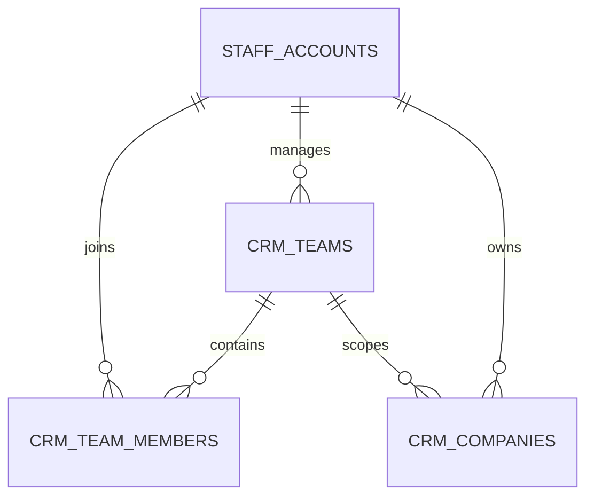
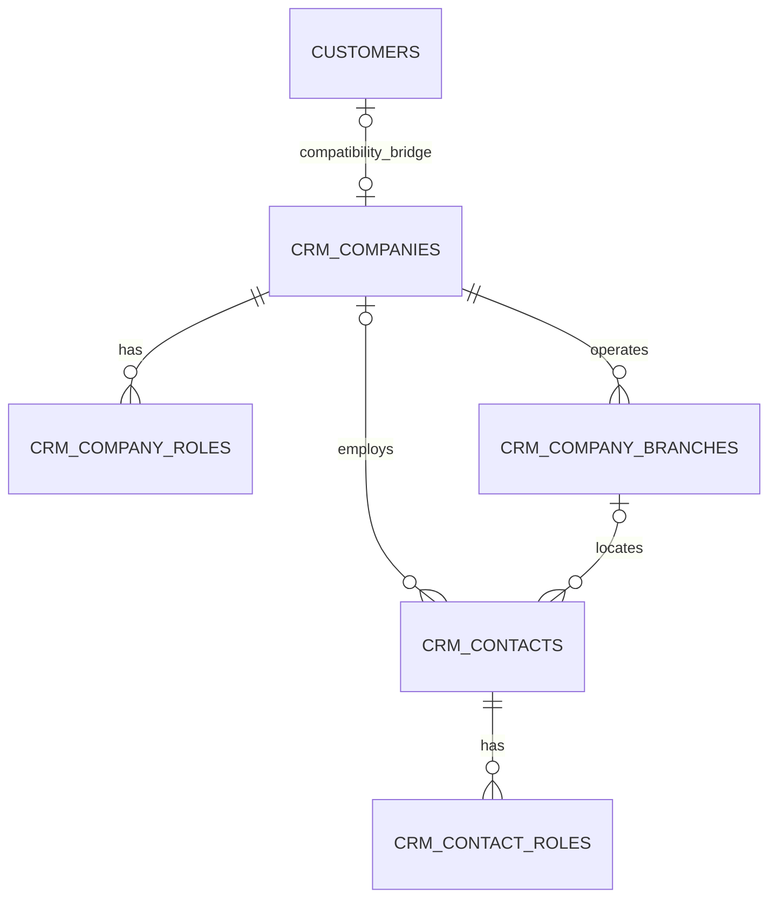
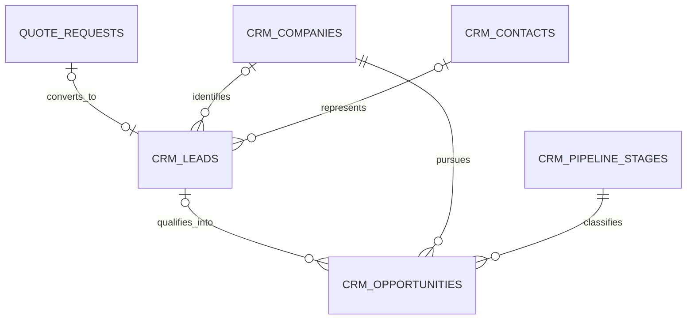
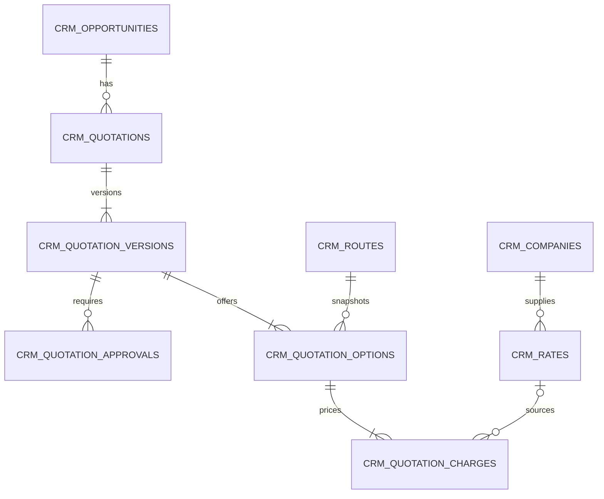
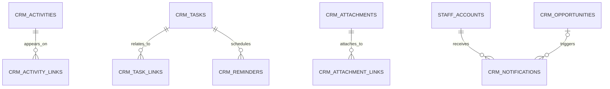
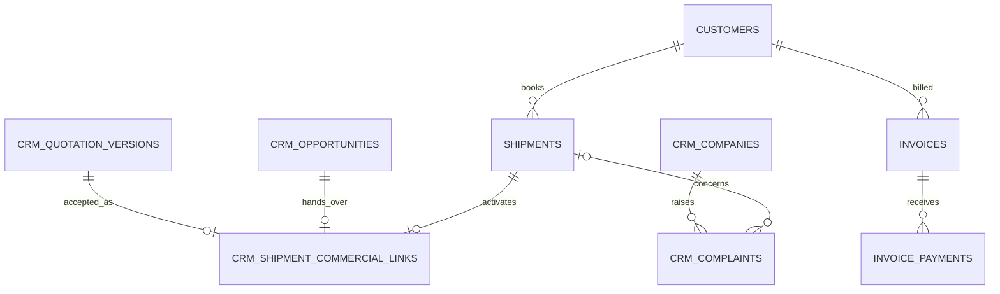

# CRM Data Model

**Document status:** Target model; implementation is phased
**Source baseline:** `origin/main` / `81ff43f421187eb76ef6c732ee141a7084a73dc3`
**Related documents:** [Product Requirements](./CRM-PRODUCT-REQUIREMENTS.md), [Repository Audit](./CRM-REPOSITORY-AUDIT.md), [User Flows](./CRM-USER-FLOWS.md), [Permissions Matrix](./CRM-PERMISSIONS-MATRIX.md), [UI Information Architecture](./CRM-UI-INFORMATION-ARCHITECTURE.md), [Implementation Roadmap](./CRM-IMPLEMENTATION-ROADMAP.md), [Backlog](./CRM-BACKLOG.md), [Risks and Decisions](./CRM-RISKS-AND-DECISIONS.md)

## 1. Model boundaries and conventions

This document defines the target data model. It does not assert that these CRM tables are live. The initial deployment slice contains only Commercial Foundation records: teams/ownership, companies/contacts, leads, opportunities/pipeline, activities/tasks, search/audit support, and the website quote-request bridge. Imports/exports, saved views, automation, native quotations/costing/PDF, shipment handover, complaints, retention, and integrations remain later phases.

### 1.1 Architectural rules

1. New CRM tables use the `crm_` prefix and integer generated primary keys to align with `staff_accounts`, `customers`, `quote_requests`, and `shipments`. Existing UUID Finance identifiers remain unchanged.
2. All timestamps that represent an instant use `timestamptz`; business dates use `date`. User-facing time is Asia/Jakarta unless the user selects another display zone.
3. Monetary values use `numeric(18,2)` and ISO 4217 `char(3)` currency codes. Weight/volume/rate quantities use `numeric(18,6)` where multiplication precision matters.
4. Mutable master/work records have `created_at`, `created_by`, `updated_at`, `updated_by`, `archived_at`, `archived_by`, and `archive_reason`. Active-only partial unique indexes allow a deliberately archived value to be reused only after review.
5. Archiving is the default delete behavior. Immutable quotation versions, charges, approval decisions, commercial handover snapshots, payments, and audit records are never hard-deleted or edited after finalization.
6. All status changes use tested transition services and database checks/FKs. Pages may not write status text directly.
7. Supplier cost, supplier rate, gross profit, gross margin, approval comments, and internal notes are confidential fields. They are selected only into manager-safe DTOs for Sales Manager, Director, Finance, and Super Admin.
8. A neutral Company can have several roles. A Vendor is a Company with a vendor-like role, not a duplicate person/company table.
9. Existing `customers`, `quote_requests`, `shipments`, `invoices`, and `invoice_payments` remain authoritative within their current boundaries and are linked rather than cloned.
10. No tenant/company discriminator is added in v1. The schema must not imply multi-tenancy.

### 1.2 Common audit columns

Unless an entity section says otherwise, every mutable `crm_*` table has:

| Column | Type | Rule |
|---|---|---|
| `id` | integer identity | Primary key. |
| `created_at` | timestamptz | Required, defaults to `now()`. |
| `created_by` | integer FK `staff_accounts.id` | Required. No cascade delete. |
| `updated_at` | timestamptz | Required, defaults to `now()`; changed on every mutation. |
| `updated_by` | integer FK `staff_accounts.id` | Required. |
| `archived_at` | timestamptz | Null while active. |
| `archived_by` | integer FK `staff_accounts.id` | Required when `archived_at` is set. |
| `archive_reason` | text | Required and nonblank when archived. |

Constraint: archive metadata must be either all null or complete. Restore clears archive fields and writes a separate audit event; it never erases history.

## 2. Canonical codes and lifecycle values

Use lower-case `snake_case` values in storage and TypeScript literal unions. Database checks or seeded lookup FKs reject unknown values.

| Domain | Canonical values |
|---|---|
| Staff CRM role | `superadmin`, `director`, `sales_manager`, `sales`, `customer_service`, `operations`, `finance`, `viewer`; legacy `admin` is mapped during transition, not assigned as a new CRM business role |
| Team membership | `manager`, `member` |
| Company role | `prospect`, `customer`, `vendor`, `overseas_agent`, `airline`, `shipping_line`, `trucking_provider`, `customs_ppjk_partner`, `warehouse`, `insurer`, `referral_partner`, `other` |
| Company risk | `low`, `medium`, `high`, `restricted` |
| Contact role | `primary`, `decision_maker`, `quotation`, `billing`, `operations`, `shipper`, `consignee`, `compliance`, `other` |
| Lead source | `website_quote`, `whatsapp`, `email`, `referral`, `existing_customer`, `overseas_agent`, `direct_outreach`, `import`, `other` |
| Lead status | `new`, `contacted`, `awaiting_information`, `qualified`, `disqualified`, `converted`, `dormant` |
| Lead priority | `low`, `normal`, `high`, `urgent` |
| Opportunity state | `open`, `won`, `lost`, `on_hold` |
| Opportunity stage | `inquiry_received`, `qualification`, `rate_sourcing`, `costing`, `quotation_draft`, `quotation_sent`, `negotiation`, `verbal_confirmation`, `won`, `lost`, `on_hold` |
| Quotation/version status | `draft`, `pending_approval`, `approved`, `sent`, `accepted`, `rejected`, `expired`, `superseded`, `withdrawn` |
| Approval status | `pending`, `approved`, `rejected`, `cancelled` |
| Requested service | `air_freight`, `sea_freight`, `domestic_freight`, `freight_forwarding`, `customs_clearance_coordination`, `undername_import`, `door_to_door`, `airport_port_handling`, `other` |
| Freight mode | `air`, `sea_fcl`, `sea_lcl`, `domestic_air`, `domestic_sea`, `domestic_road`, `multimodal`, `other` |
| Service scope | `door_to_door`, `door_to_port`, `door_to_airport`, `port_to_port`, `airport_to_airport`, `port_to_door`, `airport_to_door` |
| Incoterm | `EXW`, `FCA`, `FOB`, `CFR`, `CIF`, `CPT`, `CIP`, `DDU`, `DAP`, `DPU`, `DDP`, `other` (`DDU` is retained for customer language; current Incoterms edition must be stated in terms) |
| Activity type | `call`, `whatsapp`, `email`, `meeting`, `site_visit`, `note`, `status_change`, `assignment`, `system` |
| Task status | `open`, `in_progress`, `completed`, `cancelled` |
| Task priority | `low`, `normal`, `high`, `urgent` |
| Reminder status | `scheduled`, `sent`, `acknowledged`, `cancelled`, `failed` |
| Attachment confidentiality | `internal`, `commercial`, `customer_shareable`, `restricted_cost` |
| Notification channel/status | `in_app`, `email`; `pending`, `sent`, `read`, `failed`, `cancelled` |
| Complaint category | `delay`, `damage`, `missing_cargo`, `documentation`, `customs_issue`, `billing_issue`, `rate_discrepancy`, `communication_issue`, `delivery_issue`, `other` |
| Complaint status | `new`, `triaged`, `investigating`, `awaiting_internal`, `awaiting_customer`, `resolved`, `closed`, `reopened` |
| Import type | `companies`, `contacts`, `leads`, `opportunities`, `external_quotations` |
| Import status | `uploaded`, `mapping`, `validating`, `ready`, `committing`, `completed`, `failed`, `cancelled` |

Lead statuses do not repeat quotation/pipeline stages. After qualification, commercial progress belongs to Opportunity. This avoids ambiguous records such as a Lead and Opportunity both being “Quotation Sent.”

## 3. Identity, roles, and teams

### 3.1 User — existing `staff_accounts`

**Purpose:** authenticated staff identity. Reuse; do not create `crm_users`.

| Fields | Rules |
|---|---|
| Existing: `id`, `full_name`, `email`, `password_hash`, `role`, `is_active`, `session_version`, `last_login`, audit timestamps | Existing email is unique. Password hash and session state never enter CRM DTOs. |
| Proposed additive: `crm_role_code` or approved mapping from existing `role` | **Decision Required:** final migration approach. New assignments must use the canonical CRM roles. |

Indexes: existing email uniqueness; add `(crm_role_code, is_active)` only if an additive role column is approved. Deactivation retains ownership history and forces reassignment of active work.

### 3.2 Role and Permission — code-defined interface

Roles and permission keys are not user-editable database masters in v1. Canonical permission keys are source-defined and version-controlled. Database records store assignments and team membership; the audit log records changes. This prevents an administrator from silently creating an unreviewed permission that exposes cost.

If `crm_staff_role_assignments` is needed to support more than one role per user, fields are `staff_account_id`, `role_code`, `effective_from`, `effective_until`, common audit columns; unique active `(staff_account_id, role_code)`. Until then, the mapped staff role is singular.

### 3.3 Team — `crm_teams`

**Purpose:** ownership and manager visibility boundary.

| Main fields | Required/constraints |
|---|---|
| `name`, `code`, `description`, `manager_id` | `name`, `code`, `manager_id` required. `code` upper snake/alphanumeric; manager must be active and hold Sales Manager/Director/Super Admin authorization at assignment time. |
| Common audit/archive fields | Required as defined in §1.2. |

Unique: active `lower(trim(name))`; active `upper(trim(code))`.
Indexes: `manager_id`, `archived_at`.
Archive: allowed only when no active records are owned solely by the team and all active members/records are reassigned.

### 3.4 Team Member — `crm_team_members`

Fields: `team_id` FK, `staff_account_id` FK, `membership_role`, `effective_from`, `effective_until`, common audit/archive fields.
Required: team, staff, membership role, effective start.
Unique: one active membership per `(team_id, staff_account_id)`.
Indexes: `(staff_account_id, effective_until)`, `(team_id, membership_role, effective_until)`.
Constraint: effective end is null or after start. A user may belong to more than one team only when approved; ownership must still select one `owner_team_id`.

## 4. Shared company and contact master

### 4.1 Company — `crm_companies`

**Purpose:** neutral legal/trading organization master for prospects, customers, agents, suppliers, and carriers.

| Main fields | Required/constraints |
|---|---|
| `company_number` | Required generated business key, unique (`CMP-...`); immutable. |
| `legal_name`, `trading_name`, `normalized_name` | Legal name and normalized name required. Normalized name is application-maintained for duplicate search, not customer display. |
| `country_code`, `default_currency`, `industry`, `website` | Country required ISO 3166-1 alpha-2; currency required ISO 4217. |
| `tax_number`, `nib`, `registration_details` | Optional until management sets compliance rules. Values are internal and field-restricted. |
| `customer_category`, `credit_terms_days`, `payment_terms`, `preferred_services` | Optional; credit days `>= 0`; services use canonical codes. Finance owns final credit approval. |
| `risk_level`, `compliance_notes`, `internal_remarks`, `is_active` | Risk defaults `medium`; notes never customer-facing. `is_active` is business status; archive is deletion state. |
| `owner_id`, `owner_team_id` | Required owner; team required when owner has team scope. |
| `legacy_customer_id` | Nullable FK `customers.id`; unique when nonnull. This is the compatibility bridge. |
| `last_shipment_at`, retention metrics | Not stored in Foundation. Derived/materialized in Phase 5 from authoritative shipments/Finance. |
| Common audit/archive fields | Required. |

Unique: active exact normalized legal name + country is a hard-stop candidate only after review; `legacy_customer_id` unique partial; tax/NIB uniqueness is country/rule dependent and **Decision Required**.
Indexes: `normalized_name`, `(owner_id, archived_at)`, `(owner_team_id, archived_at)`, `(country_code, archived_at)`, normalized email/domain where present, optional trigram index after extension verification.
Duplicate detection: exact tax/NIB or legacy ID is a block; normalized name+country, email domain, phone, website domain, and address are scored warnings. A merge requires a privileged action, a surviving record, link reassignment, field-by-field resolution, and audit.
Archive: cannot archive with open Opportunities, active customer portal account, open Complaints, or active shipment work unless each dependency is reassigned or an authorized override is recorded.

### 4.2 Company Role — `crm_company_roles`

Fields: `company_id`, `role_code`, `valid_from`, `valid_until`, `notes`, common audit/archive fields.
Required: company and role.
Unique: active `(company_id, role_code)`.
Indexes: `(role_code, archived_at)`, `company_id`.
Constraint: validity end follows start. Vendor, airline, shipping line, trucking provider, and customs/PPJK partner are roles on Company; there is no separate Vendor master.

### 4.3 Branch — `crm_company_branches`

Fields: `company_id`, `branch_code`, `name`, `address_line_1`, `address_line_2`, `city`, `province`, `postal_code`, `country_code`, `phone`, `email`, `is_head_office`, common audit/archive fields.
Required: company, name, country.
Unique: active `(company_id, branch_code)` when code is present; at most one active head office per company via partial unique index.
Indexes: `company_id`, normalized city/country, normalized email/phone.
Archive: blocked while referenced as the active billing/operational branch unless replaced.

### 4.4 Contact — `crm_contacts`

Fields: `contact_number`, `company_id` nullable, `branch_id` nullable, `full_name`, `job_title`, `email`, `phone`, `whatsapp`, `country_code`, `preferred_channel`, `is_primary`, `owner_id`, `owner_team_id`, `internal_notes`, common audit/archive fields.
Required: number, full name, owner; at least one of email/phone/WhatsApp. Branch, when present, must belong to Company.
Unique: business key; exact active normalized email is a duplicate block only within an approved context because shared inboxes exist; normalized phone/WhatsApp produce duplicate candidates.
Indexes: `(company_id, archived_at)`, `(owner_id, archived_at)`, normalized email, phone, WhatsApp, name.
Archive: preserves activities and history; open tasks are reassigned/cancelled first.

### 4.5 Contact Role — `crm_contact_roles`

Fields: `contact_id`, `role_code`, common audit/archive fields.
Unique: active `(contact_id, role_code)`.
Index: `(role_code, archived_at)`.
One contact may be billing, operational, and decision-maker simultaneously.

## 5. Leads and opportunities

### 5.1 Lead — `crm_leads`

**Purpose:** one inbound/outbound prospecting inquiry before qualification and conversion.

| Main fields | Required/constraints |
|---|---|
| `lead_number`, `title`, `inquiry_at` | Required; lead number unique and immutable. |
| `source`, `source_detail`, `source_quote_request_id` | Source required. Quote-request ID nullable FK and unique when present, providing idempotent conversion. |
| `company_id`, `contact_id` | Nullable during initial intake. Contact, if linked, must belong to linked company or be independent. |
| `company_name_snapshot`, `contact_name_snapshot`, `email_snapshot`, `phone_snapshot`, `whatsapp_snapshot`, `country_code`, `industry` | Intake snapshots retained even after linking for source fidelity. Contact name and at least one communication method required unless source is direct outreach with an approved exception. |
| `status`, `priority`, `qualification_score` | Required. Score integer `0..100`; score does not automatically qualify a Lead. |
| `service_type`, `additional_service_types`, `service_scope`, `origin_text`, `origin_code`, `destination_text`, `destination_code`, `commodity`, `incoterm` | Service/route inquiry. Required before qualification: service, origin, destination, commodity or cargo description. |
| `gross_weight_kg`, `volume_cbm`, `chargeable_weight_kg`, `number_of_packages`, `dimensions_json` | Nonnegative; packages positive when present. JSON structure versioned and validated; Phase 3 may normalize packages. |
| `target_shipment_date`, `estimated_frequency`, `estimated_monthly_volume`, `customer_target_rate`, `target_rate_currency` | Optional; currency required if target rate exists. |
| `internal_notes`, `last_contacted_at`, `next_follow_up_at`, `disqualification_reason`, `dormant_reason` | Reason required for terminal/nonactive statuses as applicable. |
| `owner_id`, `owner_team_id` | Required; drives row scope. |
| `converted_at`, `converted_by` | Required when status is `converted`. |
| Common audit/archive fields | Required. |

Indexes: unique lead number; unique partial source quote request; `(owner_id, status, next_follow_up_at, archived_at)`, `(owner_team_id, status, next_follow_up_at, archived_at)`, `(status, next_follow_up_at)`, `(company_id, archived_at)`, normalized snapshot email/phone, route/service/date filters.
Transition constraints: `qualified` requires minimum qualification fields; `disqualified` requires reason; `converted` requires at least one Opportunity created in the same transaction; terminal statuses cannot have an overdue follow-up except a deliberate reactivation task.
Archive: privileged only; ordinary closure uses `disqualified`, `converted`, or `dormant`.

### 5.2 Pipeline Stage — `crm_pipeline_stages`

**Purpose:** ordered single-pipeline stage metadata while keeping canonical stage codes stable.

Fields: `code` text PK, `label`, `sort_order`, `default_probability`, `terminal_state` nullable (`won`, `lost`, `on_hold`), `is_active`, audit timestamps/users.
Required: all except terminal state. Probability `0..100`; unique sort order and label among active stages.
Seed: the canonical Opportunity stages in §2.
Archive: stage code cannot be removed while referenced; mark inactive only after opportunities are migrated through an audited operation. Labels/probabilities may be configured by authorized settings users; codes and terminal meanings remain source-controlled.

### 5.3 Opportunity — `crm_opportunities`

**Purpose:** a qualified commercial pursuit. One Lead can create multiple Opportunities over time, for different lanes/services/shipments.

| Main fields | Required/constraints |
|---|---|
| `opportunity_number`, `title`, `lead_id`, `company_id`, `primary_contact_id` | Number/title/company required. Lead optional for direct creation; contact must relate to company or be explicitly confirmed. |
| `state`, `stage_code`, `probability` | Required; stage FK; probability `0..100`. `won/lost/on_hold` stages must align with state. |
| `service_type`, `service_scope`, `origin_text/code`, `destination_text/code`, `commodity`, `incoterm`, cargo aggregates | Service, origin, destination required before rate sourcing. Positive checks on quantities. |
| `estimated_sell_amount`, `estimated_cost_amount`, `estimated_gross_profit`, `estimated_margin_pct`, `currency` | Currency required. Cost/profit/margin confidential. Values nonnegative except an explicitly approved negative profit; arithmetic is recalculated server-side. |
| `expected_close_date`, `next_action`, `action_due_at` | Next action and due time required for open/on-hold work unless a documented exception is approved. |
| `external_quotation_reference`, `external_quotation_attachment_id`, `external_quotation_status` | Foundation bridge while native Quotation is unavailable. Status: `not_started`, `draft`, `sent`, `accepted`, `rejected`, `expired`. |
| `owner_id`, `owner_team_id` | Required. |
| `won_at`, `lost_at`, `lost_reason_code`, `lost_reason_detail`, `on_hold_reason` | Required according to state. |
| Common audit/archive fields | Required. |

Indexes: unique number; `(state, stage_code, expected_close_date)`, owner/team pipeline indexes, `(company_id, state)`, `lead_id`, route/service, action due.
State invariants: won requires `stage=won`, `won_at`, company, and accepted native/external quotation evidence; lost requires `stage=lost`, `lost_at`, and lost reason; on-hold requires reason and review date; reopening is audited and manager-authorized after won/lost.
Archive: prohibited for open/on-hold records; close or reassign first.

## 6. Freight quotation and rates — Phase 3 target

None of the entities in this section should be presented as live in the Commercial Foundation deployment.

### 6.1 Quotation — `crm_quotations`

Fields: `quotation_number`, `opportunity_id`, `company_id`, `primary_contact_id`, `current_version_id` nullable, `accepted_version_id` nullable, `status`, `owner_id`, `owner_team_id`, `expires_at`, common audit/archive fields.
Required: number, opportunity, company, status, owner.
Unique: quotation number; one accepted version per quotation; accepted version must belong to the same quotation.
Indexes: `(opportunity_id, status)`, `(company_id, created_at)`, `(owner_id, status, expires_at)`, `(status, expires_at)`.
Archive: drafts may archive; sent/accepted/rejected/expired/withdrawn headers are retained. `current_version_id` and denormalized status change in the same transaction as version transitions.

### 6.2 Quotation Version — `crm_quotation_versions`

**Immutable after submission for approval.** A revision clones the prior version and receives `version_number + 1`.

Fields:

- Keys: `quotation_id`, `version_number`, `supersedes_version_id`, `status`.
- Customer snapshot: legal/trading name, address, contact name/email/phone, tax identity only when needed.
- Freight snapshot: mode, scope, incoterm plus edition, origin/destination, route summary, carrier display name, schedule, transit time, commodity, cargo flags, pieces, gross/volume/chargeable weight, CBM.
- Commercial snapshot: selling currency, reporting currency (`IDR` default), exchange-rate source/date/value, subtotal, discount, tax treatment, VAT, duty/tax estimate, selling total.
- Confidential snapshot: cost total, gross profit, gross margin, supplier references.
- Terms: validity start/end, payment terms, exclusions, terms and conditions, template code/version.
- Approval/send: submitted, approved/rejected, sent, accepted, expired, withdrawn timestamps and actor IDs; customer acceptance evidence and share-token hash.
- Audit: `created_at`, `created_by`; no `updated_at` for immutable business content. Lifecycle event timestamps are written by dedicated transitions.

Constraints: unique `(quotation_id, version_number)`; version positive; all currency codes present when amounts exist; exchange rate positive; totals match child charges within currency rounding; validity end follows start; accepted requires prior sent/approved state and evidence; only one accepted version per quotation.
Indexes: `(quotation_id, version_number desc)`, `(status, validity_end)`, approval/send timestamps, share-token hash unique partial.
Delete: never after approval submission; abandoned draft versions may be archived with audit before external use.

### 6.3 Quotation Option — `crm_quotation_options`

Fields: `quotation_version_id`, `option_number`, `label`, `route_id`, mode/scope, carrier Company snapshot, schedule, transit time min/max, origin/destination snapshots, currency, exchange-rate snapshot, cost total, selling total, gross profit, margin, sort order, `is_recommended`, customer notes.
Required: version, option number, label, route/mode/scope and currency.
Unique: `(quotation_version_id, option_number)`; at most one recommended option per version.
Indexes: `quotation_version_id`, carrier/route.
Immutable with parent version. Confidential fields never enter customer DTOs.

### 6.4 Quotation Charge — `crm_quotation_charges`

Fields: `quotation_option_id`, `charge_code`, `description`, `category`, `basis` (`flat`, `per_kg`, `per_chargeable_kg`, `per_cbm`, `per_shipment`, `per_package`, `percentage`, `actual_at_cost`), quantity, unit, minimum, cost unit rate/currency/exchange rate, sell unit rate/currency/exchange rate, cost total, sell total, tax code/rate/amount, `customer_visible`, `confidential_note`, sort order, source rate ID.
Required: option, code, description, basis, quantity, currencies, totals.
Constraints: nonnegative quantities/rates/minimum; exchange rates positive; customer-visible description nonblank; arithmetic reconciles within currency rounding.
Indexes: `(quotation_option_id, sort_order)`, `source_rate_id`, charge category.
Immutable with parent version. Cost columns are manager-safe only.

### 6.5 Quotation Approval — `crm_quotation_approvals`

Fields: `quotation_version_id`, `rule_code`, `requested_by/at`, `assigned_approver_id`, `status`, `decided_by/at`, `decision_reason`, `snapshot_margin_pct`, `snapshot_discount_pct`, `snapshot_total`, currency.
Required: version, rule, requester, approver, status. Decision fields required for approved/rejected.
Unique: one active `(quotation_version_id, rule_code, assigned_approver_id)` request.
Indexes: `(assigned_approver_id, status, requested_at)`, `quotation_version_id`.
Delete/edit: never; cancellation or a new decision event supersedes. Approval thresholds and minimum margins are **Decision Required**.

### 6.6 Route — `crm_routes`

Fields: `route_code`, mode, origin location code/name/country, destination location code/name/country, carrier_company_id nullable, service_name, via points JSON, default transit min/max, notes, active dates, common audit/archive fields.
Required: code, mode, origin, destination.
Unique: active route code; duplicate route candidates on mode/origin/destination/carrier/service.
Indexes: mode + origin + destination, carrier, validity.
Archive: allowed when historical quotations retain route snapshots.

### 6.7 Rate — `crm_rates`

**Purpose:** reusable supplier/customer-specific rate source, never a shipment charge ledger.

Fields: `rate_number`, supplier Company, customer Company nullable, route, service/mode/scope, cargo/commodity applicability, charge code/basis, minimum, cost rate/currency, sell guidance nullable, validity start/end, source attachment, terms, approval state, owner, common audit/archive fields.
Required: number, supplier, route, charge, basis, cost/currency, validity. Supplier must have a vendor-like role.
Unique: rate number.
Indexes: `(route_id, validity_end, approval_state)`, `(supplier_company_id, validity_end)`, customer-specific lookup, service/commodity.
Constraints: rates/minimum nonnegative, validity ordered.
Archive: expired rates remain queryable for audit but excluded from new costing. Quotation charges copy a snapshot; later rate edits never alter a quotation version.

## 7. Activities, tasks, reminders, attachments, and notifications

### 7.1 Activity — `crm_activities`

Fields: `activity_number`, type, subject, details, outcome, occurred_at, owner_id, owner_team_id, external_provider, external_message_id, direction (`inbound`, `outbound`, `internal`), customer_visible false by default, common audit/archive fields.
Required: number, type, subject, occurrence, owner.
Unique: activity number; `(external_provider, external_message_id)` partial unique for future idempotent ingestion.
Indexes: `(owner_id, occurred_at desc)`, `(owner_team_id, occurred_at desc)`, `(type, occurred_at)`.
Archive: correction requires reason; do not overwrite an external communication. A correcting Activity may supersede it.

### 7.2 Activity Link — `crm_activity_links`

Fields: `activity_id` plus exactly one of `company_id`, `contact_id`, `lead_id`, `opportunity_id`, `quotation_id`, `shipment_id`, `complaint_id`; `created_at/by`.
Constraint: exactly one target FK is nonnull.
Unique: each activity-target pair.
Indexes: one partial target index per FK plus `activity_id`.
An Activity can appear on several timelines by having several link rows while retaining referential integrity.

### 7.3 Task — `crm_tasks`

Fields: `task_number`, subject, details, status, priority, due_at, owner_id/team_id, created_from_rule nullable, completed_at/by, outcome, common audit/archive fields.
Required: number, subject, status, priority, owner; due time required for open follow-up tasks.
Unique: task number; optional automation dedupe key unique while active.
Indexes: `(owner_id, status, due_at)`, `(owner_team_id, status, due_at)`, `(status, priority, due_at)`.
Constraint: completed fields required only when completed; cancelled tasks require reason.
Archive: completed/cancelled only. Open tasks must be reassigned or cancelled.

### 7.4 Task Link — `crm_task_links`

Same typed-target design as Activity Link. Exactly one target per row; one Task may link to multiple relevant records. Target indexes support detail-page task panels.

### 7.5 Reminder — `crm_reminders`

Fields: `task_id`, `recipient_staff_id`, `scheduled_for`, `channel`, `status`, `sent_at`, `acknowledged_at`, `attempt_count`, `last_error_code`, `dedupe_key`, audit timestamps/users.
Required: task, recipient, schedule, channel, status.
Unique: dedupe key; `(task_id, recipient, scheduled_for, channel)`.
Indexes: `(status, scheduled_for)`, `(recipient_staff_id, status, scheduled_for)`.
Delete: never after send attempt; cancel instead. Error text is sanitized and contains no provider secrets.

### 7.6 Attachment — `crm_attachments`

Fields: `attachment_number`, file name, object key, MIME type, bytes, checksum SHA-256, confidentiality, document type, version, supersedes_attachment_id, status (`current`, `superseded`, `archived`), uploaded_by/at, scan status, common archive metadata.
Required: business key, sanitized file name, private object key, MIME, size, checksum, confidentiality, uploader.
Unique: attachment number; object key; optional content duplicate warning by checksum; version uniqueness is enforced per linked record/document type by service transaction.
Indexes: checksum, `(status, uploaded_at)`, confidentiality.
Archive: metadata retained; object deletion follows approved retention, not ordinary archive. Signed downloads are generated only after authorization.

### 7.7 Attachment Link — `crm_attachment_links`

Typed-target design matching Activity Link; exactly one Company, Contact, Lead, Opportunity, Quotation, Shipment, Complaint, or Import Job FK per row. Unique active attachment-target link; indexed by each target.

### 7.8 Notification — `crm_notifications`

Fields: recipient staff, type code, title, body, deep-link path, channel, status, scheduled/sent/read timestamps, dedupe key, related task/opportunity/quotation nullable, provider message ID, sanitized failure code, audit timestamps.
Required: recipient, type, title, channel, status.
Unique: dedupe key; provider message ID partial unique.
Indexes: `(recipient_staff_id, status, created_at desc)`, `(status, scheduled_for)`.
Delete: retain according to the approved notification/audit retention policy; read/cancel instead of hard delete in the active window.

## 8. Operations and Finance links — later phases

### 8.1 Shipment — existing `shipments`

Remain authoritative for execution. Existing `id`, tracking, customer, status, route, operational stage, readiness, owner, risk, idempotency, void/restore, and timestamps are not duplicated in CRM.

### 8.2 Commercial Shipment Link — `crm_shipment_commercial_links`

Fields: `shipment_id` FK existing shipment, `opportunity_id`, accepted `quotation_version_id`, `idempotency_key`, `handover_snapshot` JSONB with schema version, `created_at/by`, `activated_at/by`, `activation_note`.
Required: shipment, opportunity, accepted version, key, snapshot.
Unique: shipment ID; accepted quotation version; idempotency key.
Indexes: opportunity, activation state.
Immutable: handover snapshot never changes. Corrections produce a separate audited operational amendment, not a rewrite. Shipment is created at existing `operational_stage=intake`; Operations activates it.

### 8.3 Invoice and Payment — existing tables

`invoices` and `invoice_payments` remain Finance-owned. CRM exposes authorized read projections keyed through existing customer/shipment relationships. No CRM invoice/payment copy table is created. Historical customer names/totals come from invoice snapshots, not current Company fields.

### 8.4 Complaint — `crm_complaints`

Fields: `complaint_number`, company, contact nullable, shipment nullable, invoice nullable, category, description, priority, owner/team, status, opened_at, SLA due, root cause, corrective action, resolution, resolved/closed timestamps/users, customer response, common audit/archive fields.
Required: number, company, category, description, priority, owner, status, opened date. Related shipment required when the case is shipment-specific.
Unique: complaint number.
Indexes: `(owner_id, status, sla_due_at)`, `(company_id, status)`, shipment, category/date.
Constraints: resolution/root cause/corrective action/resolved metadata required for resolved; closing requires resolved state and customer response or documented exception; reopening requires a reason and new SLA due time.
Archive: closed only; case history and attachments retained per policy.

## 9. Imports, saved views, and audit

### 9.1 Import Job — `crm_import_jobs`

Fields: `job_number`, import type, original file attachment ID, status, source label, mapping JSON + version, total/valid/warning/error/committed row counts, dry-run checksum, approved_by/at, started/completed timestamps, idempotency key, sanitized failure code, common audit/archive fields.
Required: number, type, file, status, creator, idempotency key.
Unique: job number, idempotency key.
Indexes: `(status, created_at)`, creator/date, import type/date.
Constraints: counts nonnegative and internally consistent; commit requires `ready` state, explicit approval, and unchanged file/mapping checksum.
Archive: only completed/failed/cancelled; underlying file follows retention policy.

### 9.2 Import Row — `crm_import_rows`

Fields: import job, source row number, raw payload JSONB, normalized payload JSONB, validation status (`valid`, `warning`, `error`, `committed`, `skipped`), error codes/messages, duplicate candidate references, resolution (`create`, `update`, `merge`, `skip`), committed entity type/ID, row checksum, timestamps.
Required: job, row number, raw payload, status, checksum.
Unique: `(import_job_id, source_row_number)`; `(import_job_id, row_checksum)` warning/deduplication index.
Indexes: `(import_job_id, validation_status)`, committed entity.
Delete: cascades only if an uncommitted job is safely discarded; committed provenance is retained.

### 9.3 Saved View — `crm_saved_views`

Phase 2/later. Fields: owner, module code, name, filter JSON with schema version, sort JSON, column JSON, visibility (`private`, `team`), team ID nullable, is default, common audit/archive fields.
Unique: active `(owner_id, module_code, lower(name))`; one default per owner/module.
Indexes: owner/module, team/module.
Filter keys are allow-listed server-side; raw SQL is never stored.

### 9.4 Audit Log — `crm_audit_logs`

Append-only fields: `id` bigserial, action code, entity type/ID, actor staff ID nullable for system, occurred_at, reason, request/correlation ID, source (`ui`, `import`, `automation`, `integration`, `system`), before/after redacted JSONB, metadata redacted JSONB, sensitivity class, IP/user-agent hashes where approved.
Required: action, entity, timestamp, source. Actor required except system actions.
Indexes: `(entity_type, entity_id, occurred_at desc)`, `(actor_id, occurred_at desc)`, `(action, occurred_at desc)`, correlation ID.
Constraints: no update/delete permissions for application role; redaction allow-list; cost reveal events record field names and purpose, not full values.
Retention: **Decision Required**. Export, permission, approval, merge, archive/restore, ownership, import commit, shipment conversion, and explicit restricted-field reveal are mandatory events.

## 10. Search and derived reporting

### Search

- Store normalized name, email, phone/WhatsApp, business numbers, route codes, and references alongside display values.
- Use B-tree/partial indexes for equality, owner/status/date queues, and business keys.
- Use bounded `ILIKE` only for small result sets. Add `pg_trgm` indexes only after verifying the extension on every target environment.
- Search queries call the same row-scope policy as list/detail reads. Search result snippets never expose cost, internal notes, or customer portal data.
- No external search index in v1.

### Reporting

Pipeline totals can be queried from Opportunities initially. Revenue, gross profit, margin, retention, and account health must be derived from authoritative accepted quotation, shipment, invoice, and non-voided payment data. Phase 5 may add refreshable materialized views after measuring query cost. Stored “account health” values must include calculation version and refreshed timestamp.

## 11. Compatibility and migration order

1. Inventory live schema and data read-only; confirm migration numbering and target branch.
2. Add teams, companies, contacts, roles, Leads, Opportunities, activities/tasks/link tables, audit support, and bridge indexes additively.
3. Deploy code capable of reading legacy records without requiring backfill.
4. Stage customer-to-company candidate mapping. Exact legacy ID remains the bridge; ambiguous duplicates require human resolution.
5. Backfill in idempotent, checksummed batches. Do not copy portal password hashes into CRM tables.
6. Route new shared-company edits through one service and write explicit compatibility snapshots where legacy consumers still require them.
7. Convert existing quote requests only on demand or through an approved idempotent job using the unique source ID.
8. Add native quotation tables in Phase 3, shipment commercial link in Phase 4, and Finance/retention projections in Phase 5.
9. Keep old routes and columns until all consumers are verified; removal requires a separate deprecation plan.

## 12. Data-model acceptance checks

- Every mutable record has complete audit and archive metadata; every immutable record has append-only lifecycle events.
- The database rejects unknown statuses, invalid percentages, negative quantities where prohibited, inconsistent terminal states, duplicate business keys, and duplicate quote/shipment conversions.
- A Company can hold multiple roles without duplicating the organization.
- Existing customer portal and Finance references remain valid through the Company bridge.
- One website Quote Request creates at most one Lead; one accepted Quotation Version creates at most one Shipment.
- One Lead may produce multiple Opportunities; a Lead cannot be converted without an Opportunity in the same transaction.
- Quotation revisions cannot alter previously approved/sent/accepted content.
- Customer-safe queries and PDFs have no cost/margin/supplier-rate fields in their types.
- Activity, Task, Attachment, and Complaint links retain database FK integrity.
- Imports are dry-run, reviewable, checksummed, idempotent, and auditable.
- Existing invoices and non-voided payment records remain the sole Finance truth.
