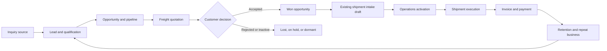

# Ambara Freight CRM — Product Requirements

**Document status:** Implementation baseline 
**Source-code baseline:** `origin/main` at `81ff43f421187eb76ef6c732ee141a7084a73dc3` 
**Reporting timezone:** Asia/Jakarta (WIB) 
**Related documents:** [Repository Audit](./CRM-REPOSITORY-AUDIT.md) · [Data Model](./CRM-DATA-MODEL.md) · [User Flows](./CRM-USER-FLOWS.md) · [Permissions](./CRM-PERMISSIONS-MATRIX.md) · [UI Architecture](./CRM-UI-INFORMATION-ARCHITECTURE.md) · [Roadmap](./CRM-IMPLEMENTATION-ROADMAP.md) · [Backlog](./CRM-BACKLOG.md) · [Risks and Decisions](./CRM-RISKS-AND-DECISIONS.md)

## 1. Executive summary

PT Ambara Artha Globaltrans needs one internal commercial workspace designed around freight forwarding rather than a generic product-sales CRM. It must prevent inquiries from being forgotten, preserve the commercial history behind every shipment, protect supplier costs and margin, and give Sales, Customer Service, Operations, Finance, and management a shared but appropriately restricted view of the customer lifecycle.

The target lifecycle is:

The first deployment is the **Initial CRM Foundation Slice**. It includes core Companies, Contacts, Leads, Activities, Tasks, Opportunities, Pipeline, ownership, search, audit, and an idempotent website quote-request bridge. It does **not** make imports/exports, saved views, scheduled automation, native freight quotation, shipment handover, complaints, or retention live. Those remain tracked backlog or later phases. Completing the remaining safe foundation backlog produces the broader **Commercial Foundation Release** before native quotation work is considered complete.

This is an incremental extension of the existing Next.js/Neon portal. CRM remains the commercial system of record; the existing shipment module remains authoritative for execution; the existing invoice and payment modules remain authoritative for Finance; public/customer surfaces receive deliberately limited DTOs. No microservice split or multi-tenancy is included in the initial implementation.

## 2. Evidence and product boundaries

### 2.1 Source-verified current state

The source baseline contains:

- A Next.js App Router portal with server-side authentication and code-defined portal capabilities.
- `staff_accounts` with existing `superadmin`, `admin`, `operations`, `finance`, and `viewer` roles.
- A combined `customers` record that also carries portal credentials and is linked by existing shipments and invoices.
- `quote_requests`, which stores website inquiry details, assignment, next action, due date, internal notes, and a small workflow. It is inquiry intake, not a versioned freight quotation system.
- Existing shipment intake/readiness concepts, including `operational_stage`, `document_readiness`, assigned owner, next action, due dates, packages, and an idempotency key.
- Existing invoice and payment records, audit tables, shipment-document storage patterns, R2 infrastructure, Resend, and PDF generation.

These statements describe repository source only. They do not prove which migrations are applied, what production data looks like, or what is live in the deployed application. Production state must be verified separately before migrations or rollout.

### 2.2 Domain ownership

| Domain | Owns | May read from | Must not become authoritative for |
|---|---|---|---|
| CRM | Leads, Companies, Contacts, Opportunities, quotation lifecycle, activities, tasks, commercial ownership | Shipment, invoice, payment, and complaint summaries | Shipment execution events or payment balances |
| Operations | Activated shipment, routing execution, readiness, documents, tracking, operational tasks | Accepted quotation snapshot and company/contact data | Opportunity stage, supplier quotation approval, or customer relationship ownership |
| Finance | Invoices, payment ledger, balance, due dates, collections | Customer/account and approved commercial summaries | Lead/opportunity workflow or shipment execution |
| Customer portal/public API | Customer-safe tracking, documents, invoices, and later quotation acceptance | Explicit customer-safe DTOs | Internal notes, supplier rates, costs, margin, approval comments, or permission metadata |
| Shared master data | Neutral Company, Contact, Branch, service/location references | Legacy customer compatibility links | Authentication secrets or transaction snapshots |

### 2.3 Release boundaries

**Initial CRM Foundation Slice (first deployment)**

- Core Company, Contact, Lead, Activity, Task, and Opportunity records.
- Basic Pipeline/list/detail workflows, ownership, search, exact duplicate guards, and core audit.
- Existing website `quote_requests` to Lead bridge while preserving `/quotes` compatibility.
- External quotation reference/outcome only; no native costing, approval, or PDF.

**Commercial Foundation completion backlog (subsequent Phase 2 work, not initial deployment)**

- Broader Company/Branch/Contact relationship roles and privileged merge tooling.
- Completed qualification policy, unified reminder UX, and management dashboards using available CRM data.
- Saved personal/team views and mature table/Kanban behavior.
- Postgres-backed CRM search.
- Staged spreadsheet import and controlled export.
- Bulk actions and approved follow-up automation.
- Expanded audit, mobile workflow, and compatibility hardening.

**Later phases**

- Phase 3: native cost/rate sourcing, freight quotations, immutable versions, approval, PDF, sharing, and acceptance.
- Phase 4: idempotent conversion of an accepted quotation into an existing shipment intake draft and Operations activation.
- Phase 5: Finance summaries, retention, account health, inactivity signals, and complaints.
- Phase 6: Gmail, WhatsApp, scheduled automation, customer portal quotation interaction, and broader reporting integrations.

## 3. Business objectives

| ID | Objective | Target outcome |
|---|---|---|
| CRM-OBJ-001 | Protect every inquiry from neglect | Every open Lead or Opportunity has an owner and a dated next action, or is visibly non-compliant. |
| CRM-OBJ-002 | Establish one customer relationship history | Staff can find the Company, Contacts, inquiries, opportunities, communications, shipments, invoices, and complaints permitted to their role. |
| CRM-OBJ-003 | Make freight quoting controlled and auditable | Every customer-facing quotation traces to an immutable approved version and exposes no supplier cost or margin. |
| CRM-OBJ-004 | Create a clean commercial-to-operations handover | An accepted quotation creates one reviewable shipment intake draft with an immutable commercial snapshot. |
| CRM-OBJ-005 | Improve management visibility | Directors and Sales Managers can evaluate pipeline, follow-up discipline, conversion, revenue, gross profit, margin, source, service, route, and owner without relying on ungoverned spreadsheets. |
| CRM-OBJ-006 | Support repeat business | Account owners see inactivity, prior services/routes, open issues, and recommended follow-ups. |
| CRM-OBJ-007 | Preserve confidentiality and accountability | Access to personal data, exports, supplier cost, gross profit, margin, approvals, reassignment, archive/restore, and permission changes is controlled and auditable. |

## 4. Users and stakeholders

| Role | Primary jobs | Default record scope |
|---|---|---|
| Super Admin | Identity, role assignment, system configuration, break-glass support | All records; sensitive actions still audited |
| Director | Company-wide commercial oversight and policy approvals | All commercial records |
| Sales Manager | Team assignment, coaching, quotation approval, pipeline performance | Own and managed-team records |
| Sales | Capture, qualify, quote, follow up, negotiate, and close | Records assigned to the user |
| Customer Service | Maintain customer communication, tasks, service issues, and customer-safe status | Customer-facing records and communications; no supplier cost or margin |
| Operations | Review won-deal handovers and execute active shipments | Won handovers and linked operational records; no supplier cost or margin |
| Finance | Invoice, payment, collection, credit, and approved commercial summaries | Finance records and linked account summaries |
| Viewer | Controlled read-only access | Explicitly granted read scope only |
| Legacy Admin | Temporary compatibility with the existing `admin` role | Existing capabilities until individually remapped |

Customers, prospects, overseas agents, suppliers, airlines, shipping lines, trucking providers, PPJK/customs partners, and referral partners are represented as Companies and Contacts; they are not staff roles.

The complete authorization policy is canonical in [CRM-PERMISSIONS-MATRIX.md](./CRM-PERMISSIONS-MATRIX.md).

## 5. Canonical terminology

| Term | Definition |
|---|---|
| Inquiry | Raw demand received from the website, WhatsApp, email, referral, partner, existing customer, or outreach. Existing `quote_requests` are website inquiries. |
| Lead | A person/company/service need being qualified. A Lead is not yet a forecastable deal. |
| Qualified Lead | A Lead with sufficient identity, service, routing/cargo context, timing, and commercial fit to pursue. |
| Opportunity | A forecastable commercial pursuit with value, probability, stage, owner, expected close, and next action. One Company may have many Opportunities. |
| Company | Neutral legal/trading organization master that may carry one or more roles such as customer, prospect, vendor, overseas agent, airline, shipping line, trucker, or PPJK partner. |
| Customer Account | Compatibility/business relationship linked to the existing `customers` record for current portal, shipment, and Finance consumers. It is not a second editable Company master. |
| Contact | A person linked to one Company, with relationship roles such as decision-maker, billing, operations, consignee, shipper, or quotation recipient. |
| Quotation | Commercial container for customer offer history on one Opportunity. |
| Quotation Version | Immutable snapshot of customer-facing and internal pricing at one revision. A new revision creates a new version. |
| Quotation Option | One route/service alternative within a quotation version. |
| Supplier Rate | Reusable time-bound buy rate from a carrier/vendor; it never replaces the immutable snapshot used by a quotation version. |
| Selling Price | Customer-facing charge. It may be visible to Sales and customer-facing staff as permitted. |
| Supplier Cost | Confidential buy-side amount. Only Super Admin, Director, Sales Manager, and Finance may view it. |
| Gross Profit / Margin | Confidential derived commercial metrics. Only Super Admin, Director, Sales Manager, and Finance may view them. |
| Activity | Completed or historical interaction such as a call, WhatsApp, email, meeting, site visit, or note. |
| Task | Action due in the future or requiring completion; a Task may create an Activity when completed. |
| Next Action | The single most important open action for a Lead or Opportunity, backed by an open Task and due date. |
| Shipment Intake Draft | Existing shipment-system record created from an accepted quotation but gated from active execution until Operations confirms readiness. |
| Commercial Snapshot | Immutable accepted quotation/version data copied or referenced for operational and Finance traceability. |
| Archive | Reversible removal from active views. CRM business records are not hard-deleted through normal UI. |

### 5.1 Canonical statuses

**Lead**

`new` → `contacted` → `awaiting_information` → `qualified` → `converted`

Alternative terminal/non-active states: `disqualified`, `dormant`, `archived`.

Statuses such as “Preparing Quotation,” “Quotation Sent,” “Negotiation,” “Won,” and “Lost” belong to the Opportunity or Quotation after conversion; they are not duplicated on the Lead.

**Opportunity stages**

`inquiry_received`, `qualification`, `rate_sourcing`, `costing`, `quotation_draft`, `quotation_sent`, `negotiation`, `verbal_confirmation`, `won`, `lost`, `on_hold`.

**Quotation**

`draft`, `pending_approval`, `approved`, `sent`, `accepted`, `rejected`, `expired`, `superseded`, `withdrawn`.

**Task**

`open`, `in_progress`, `completed`, `cancelled` with computed `overdue` presentation when an open due date is past.

**Complaint**

`new`, `triaged`, `investigating`, `awaiting_internal`, `awaiting_customer`, `resolved`, `closed`, `reopened`.

## 6. Core workflow requirements

Detailed behavior, alternatives, and recovery paths are specified in [CRM-USER-FLOWS.md](./CRM-USER-FLOWS.md).

### 6.1 Inquiry and Lead

| ID | Requirement |
|---|---|
| CRM-FR-LEAD-001 | Authorized users can create a Lead manually from WhatsApp, email, referral, existing-customer inquiry, overseas agent, or direct outreach. |
| CRM-FR-LEAD-002 | A website `quote_request` can be reviewed and converted idempotently into one Lead while preserving the original inquiry reference and raw source values. |
| CRM-FR-LEAD-003 | The Lead captures identifier, Company/Contact links or provisional identity, country, industry, source, inquiry date, owner, priority, requested service, origin, destination, commodity, weight/dimensions/packages, Incoterm, target shipment date, frequency, monthly volume, customer target rate, currency, internal notes, attachments, qualification score, last contact, and next follow-up. |
| CRM-FR-LEAD-004 | A Lead may be saved with incomplete cargo data, but missing information is explicit and qualification/conversion is blocked until the configured minimum set is present or a manager records an exception. |
| CRM-FR-LEAD-005 | Every open Lead must have an active owner. After first contact, it must also have a next-action Task and due date unless closed, disqualified, dormant, or converted. |
| CRM-FR-LEAD-006 | Overdue, uncontacted, unassigned, and awaiting-information Leads are visible in dedicated queues and dashboard counts. |
| CRM-FR-LEAD-007 | Status changes, assignment/reassignment, priority changes, score overrides, archive/restore, and closure reasons are audited. |
| CRM-FR-LEAD-008 | Disqualification requires a structured reason and optional notes; reactivation preserves the original history. |

### 6.2 Company, Contact, and shared master data

| ID | Requirement |
|---|---|
| CRM-FR-COMPANY-001 | The system provides a neutral Company master with legal name, trading name, country, addresses/branches, tax number, NIB/registration, website, industry, roles, category, default currency, preferred services, account manager, risk, compliance notes, internal remarks, credit/payment terms, activity state, and audit fields. |
| CRM-FR-COMPANY-002 | A Company may hold multiple non-exclusive roles: prospect, customer, overseas agent, vendor, airline, shipping line, trucking provider, PPJK/customs partner, referral partner, or other. |
| CRM-FR-COMPANY-003 | The existing `customers` row remains a compatibility/account record linked to `company_id`; existing shipment, invoice, and portal references continue to work during staged migration. |
| CRM-FR-COMPANY-004 | After backfill, user-facing Company identity is edited through one Company service. Compatibility fields are synchronized deliberately and cannot drift through competing forms. |
| CRM-FR-COMPANY-005 | Duplicate review compares normalized legal/trading names, tax/NIB identifiers, domains, email addresses, and phone numbers. Exact unique identifiers block duplicates; fuzzy matches warn and require review. |
| CRM-FR-COMPANY-006 | Merge is a privileged, previewable, auditable operation that selects field winners, reassigns relationships, preserves aliases, and never silently deletes transaction history. |
| CRM-FR-CONTACT-001 | Contacts are independent people linked to one primary Company and may carry billing, operations, decision-maker, shipper, consignee, quotation recipient, or other relationship roles. |
| CRM-FR-CONTACT-002 | A Contact stores name, title, department, email(s), phone/WhatsApp, preferred channel/language, consent/preferences, country/timezone, active state, and audit fields. |
| CRM-FR-CONTACT-003 | Contact duplicate review uses normalized email and phone as strong signals and normalized name plus Company as a secondary signal. |
| CRM-FR-CONTACT-004 | Company detail provides role-permitted histories of inquiries, Leads, Opportunities, quotations, shipments, invoices, payments, activities, documents, and complaints without copying authoritative transaction data into the Company row. |

### 6.3 Activities, tasks, reminders, and communications

| ID | Requirement |
|---|---|
| CRM-FR-ACTIVITY-001 | Users can log calls, WhatsApp, email, meetings, site visits, notes, and other interactions with owner, date, outcome, next step, attachments, and linked records. |
| CRM-FR-ACTIVITY-002 | Lead, Company, Contact, Opportunity, Quotation, Shipment, and Complaint pages show one chronological activity timeline subject to field and record permissions. |
| CRM-FR-ACTIVITY-003 | Manual email/WhatsApp logs are explicitly labeled as user-entered; later provider integrations deduplicate messages using external provider IDs. |
| CRM-FR-TASK-001 | Users can create, assign, reassign, complete, cancel, and snooze Tasks with due date/time, priority, reminder, related record, and outcome. |
| CRM-FR-TASK-002 | Completing a Task records completion metadata and can prompt for a resulting Activity and next action. |
| CRM-FR-TASK-003 | A Lead or Opportunity cannot have two records designated as its single “next action”; changing it updates the backed Task transactionally. |
| CRM-FR-TASK-004 | Overdue is computed from WIB-aware due timestamps; changing timezone presentation never changes the stored instant. |
| CRM-FR-NOTIFY-001 | In-app notifications are the canonical delivery channel for assignment, reassignment, due/overdue, approval, expiry, acceptance, and handover events. |
| CRM-FR-NOTIFY-002 | Selected events may also use email. Delivery failure does not erase the in-app notification and is visible to administrators. |

### 6.4 Opportunity and pipeline

| ID | Requirement |
|---|---|
| CRM-FR-OPPORTUNITY-001 | A qualified Lead can create an Opportunity while preserving the Lead/source link; one Lead may lead to multiple Opportunities only when service/route/timing represents separate commercial pursuits. |
| CRM-FR-OPPORTUNITY-002 | The Opportunity captures Company, primary Contact, service, trade direction, origin/destination, cargo summary, owner/team, stage, probability, expected close, next action, estimated revenue, estimated cost, gross profit, margin, currency, frequency, volume, competitor/target-rate context, and loss/on-hold reasons. |
| CRM-FR-OPPORTUNITY-003 | Cost, gross profit, and margin are returned only to Super Admin, Director, Sales Manager, and Finance. Sales, Customer Service, Operations, Viewer, and customer-facing surfaces receive DTOs without those fields. |
| CRM-FR-OPPORTUNITY-004 | Stage changes enforce prerequisites: costing requires a qualified service need; quotation sent requires a sent quotation or external quotation reference; won requires accepted evidence and handover readiness; lost requires a reason. |
| CRM-FR-OPPORTUNITY-005 | Users can view authorized Opportunities in Kanban and table views with shared filters, stable sorting, and pagination. Saved personal/team views are Foundation backlog, not part of the initial deployment. |
| CRM-FR-OPPORTUNITY-006 | Dragging a Kanban card uses the same server-side transition validation, authorization, concurrency check, and audit behavior as detail-page changes. |
| CRM-FR-OPPORTUNITY-007 | Weighted pipeline uses `estimated_revenue × probability`; manual probability overrides require a reason and preserve history. |
| CRM-FR-OPPORTUNITY-008 | Won, lost, on-hold, reopened, owner, expected-close, and value changes are audited. |
| CRM-FR-OPPORTUNITY-009 | The Foundation Release supports recording an external quotation number, amount, currency, validity, attachment/link, sent date, and outcome without representing it as a native Quotation Version. |

### 6.5 Native freight quotation — Phase 3

| ID | Requirement |
|---|---|
| CRM-FR-QUOTE-001 | An Opportunity can contain one or more Quotations, each with immutable numbered Versions and one current version pointer. |
| CRM-FR-QUOTE-002 | A Quotation Version supports air, sea, domestic, airport-to-airport, port-to-port, door-to-door, and Incoterm-specific scopes including EXW, FCA, FOB, CFR, CIF, CPT, CIP, DAP, DPU, DDU as a commercial label, and DDP. Eligibility remains case-by-case. |
| CRM-FR-QUOTE-003 | A Version captures cargo, route, schedule, transit estimate, carrier, gross/chargeable weight, volume/CBM, packages, currency, exchange-rate snapshot, validity, payment terms, exclusions, assumptions, taxes, and terms. |
| CRM-FR-QUOTE-004 | A Version may offer multiple route/service Options and charge lines for freight, pickup, delivery, trucking, customs coordination, undername, handling, warehouse, screening/RA, documentation, inspection, estimated duty/tax, insurance, surcharge, and other conditional charges. |
| CRM-FR-QUOTE-005 | Every charge explicitly identifies unit/basis, quantity, currency, supplier cost, selling amount, tax treatment, customer visibility, estimate/confirmed state, and optional supplier-rate source. |
| CRM-FR-QUOTE-006 | Supplier Rates are reusable and time-bound, but a Version snapshots every applied value, FX rate, calculation input, and term so later rate changes do not alter history. |
| CRM-FR-QUOTE-007 | Once submitted for approval, a Version cannot be edited. Revisions clone it into a new draft version; sent, approved, accepted, rejected, expired, superseded, and withdrawn versions remain immutable. |
| CRM-FR-QUOTE-008 | Approval policy evaluates margin, discount, exception, conditional charge, and validity rules. Approvers see a deterministic comparison to the previous version. Approval thresholds and floors remain `Decision Required` under CRM-DEC-018. |
| CRM-FR-QUOTE-009 | Customer-facing PDF, email, WhatsApp payload, and future portal DTO contain selling prices and approved terms only. They never contain supplier cost, margin, internal notes, source-rate IDs, or approval comments. |
| CRM-FR-QUOTE-010 | Accepted, rejected, expired, revised, withdrawn, and sent events record actor, channel, time, Version, and evidence. Expiry is based on the Version validity timestamp. |
| CRM-FR-QUOTE-011 | Quotation templates may supply structure and wording but cannot silently overwrite transaction-specific cargo, route, validity, rates, or terms. |
| CRM-FR-QUOTE-012 | DDP/DDU, undername, customs, duties/taxes, dangerous goods, and controlled-commodity language must state dependencies on HS code/product form, route, consignee/importer readiness, documentation, and applicable Indonesian rules; no customs outcome is guaranteed. |

### 6.6 Acceptance and Operations handover — Phase 4

| ID | Requirement |
|---|---|
| CRM-FR-HANDOVER-001 | Only an accepted/current Quotation Version, authorized manager override, or approved external quotation reference can support a won conversion. |
| CRM-FR-HANDOVER-002 | Conversion creates or returns exactly one existing shipment record in `operational_stage = intake`, using a unique idempotency key derived from the accepted commercial source. |
| CRM-FR-HANDOVER-003 | The shipment intake contains the Company/customer link, Contacts, route, service, cargo/packages, weights, Incoterm, target date, requirements, documents, accepted selling scope, and a reference to the immutable commercial snapshot. |
| CRM-FR-HANDOVER-004 | Operations receives a review checklist and may request clarification. Clarification does not mutate the accepted quotation; any commercial change requires an approved revision/change record. |
| CRM-FR-HANDOVER-005 | The intake record is not treated as active execution until Operations confirms mandatory readiness and promotes it through the existing shipment workflow. |
| CRM-FR-HANDOVER-006 | Retried conversion, concurrent requests, or browser refresh cannot create duplicate shipments; failures are recoverable and audited. |

### 6.7 Finance, retention, reporting, and complaints — Phase 5

| ID | Requirement |
|---|---|
| CRM-FR-FINANCE-001 | CRM reads role-permitted invoice, payment, balance, due-date, and collection summaries from existing authoritative Finance logic; CRM never recalculates payment truth independently. |
| CRM-FR-FINANCE-002 | Credit terms and payment terms changes are restricted and audited; transaction snapshots remain unchanged after Company master edits. |
| CRM-FR-RETENTION-001 | Company account view derives last shipment, shipment frequency, revenue, gross profit, average margin, common service/route, open quotation, open complaint, and outstanding invoice indicators from authoritative linked data. |
| CRM-FR-RETENTION-002 | Account health and churn risk show their contributing signals and calculation date; users can distinguish derived data from manually recorded assessment. |
| CRM-FR-RETENTION-003 | Inactivity alerts and recommended follow-up dates use configurable rules by segment/service and do not mark a customer inactive merely because data synchronization failed. |
| CRM-FR-COMPLAINT-001 | Users can record a Complaint with Company, Contact, related Shipment/Invoice where applicable, category, description, priority, owner, status, root cause, corrective action, resolution, dates, customer response, and attachments. |
| CRM-FR-COMPLAINT-002 | Supported categories include delay, damage, missing cargo, documentation, customs issue, billing issue, rate discrepancy, communication issue, delivery issue, and other. |
| CRM-FR-COMPLAINT-003 | Complaints have SLA/due indicators, escalation, activity history, ownership, audit, and reopen behavior; resolution and closure are distinct. |

### 6.8 Search, filters, imports, exports, and bulk operations

| ID | Requirement |
|---|---|
| CRM-FR-SEARCH-001 | Global search covers authorized Leads, Companies, Contacts, Opportunities, Quotations, Shipments, Invoices, Complaints, and Activities; results never reveal record existence outside the caller’s scope. |
| CRM-FR-SEARCH-002 | Search starts with normalized Postgres columns and indexes; `pg_trgm` is optional after deployment support and query evidence are confirmed. No external search service is required for v1. |
| CRM-FR-SEARCH-003 | Lists support relevant combinations of owner, team, status/stage, service, origin, destination, country, commodity, source, date range, follow-up, quotation state, customer activity, revenue, and—only for authorized roles—margin. |
| CRM-FR-SEARCH-004 | Saved views store filters, sort, columns, visibility (private/team), and schema version; inaccessible fields are removed when permissions change. |
| CRM-FR-IMPORT-001 | CSV/XLSX import uses a staged Import Job: upload, file scan/validation, sheet/header selection, column mapping, normalization, validation, duplicate review, dry-run summary, approval, transactional commit, and downloadable error report. |
| CRM-FR-IMPORT-002 | Each source row has a stable row number and result. Import reruns use an idempotency fingerprint and do not silently duplicate prior committed rows. |
| CRM-FR-IMPORT-003 | Imports support Leads, Companies, Contacts, external quotation references, and Opportunities only after an entity-specific template and validation policy exists. |
| CRM-FR-IMPORT-004 | Bulk assignment, status changes, and follow-up dates show an affected-record preview, recheck authorization at commit, require confirmation, and write one batch audit plus item-level failures. |
| CRM-FR-EXPORT-001 | CSV/XLSX exports are server-generated, scoped, field-filtered by permission, rate-limited, and audited with record count and filter metadata. Supplier cost, margin, Finance fields, and personal data require their own export permissions. |

### 6.9 Dashboards and performance

| ID | Requirement |
|---|---|
| CRM-FR-REPORT-001 | Dashboards provide daily, weekly, monthly, quarterly, yearly, and explicit custom date ranges interpreted in WIB. |
| CRM-FR-REPORT-002 | Commercial metrics include new/qualified Leads, quotations sent, wins/losses, conversion, pipeline, weighted pipeline, average deal size, sales cycle, follow-up compliance, loss reason, source, owner, team, service, route, country, and customer. |
| CRM-FR-REPORT-003 | Revenue, gross profit, margin, retention, and repeat-business metrics use linked authoritative shipment/Finance data and display data freshness; pipeline estimates are labeled forecasts. |
| CRM-FR-REPORT-004 | Cost/gross-profit/margin cards, columns, exports, and chart payloads are entirely omitted for unauthorized roles, not merely hidden in the browser. |
| CRM-FR-REPORT-005 | Metric definitions, inclusion rules, currencies, exchange-rate basis, and snapshot times are documented beside or linked from each dashboard. |

## 7. Follow-up automation requirements

Automation is activated only after its underlying fields, owners, time semantics, and escalation rules are stable.

| ID | Rule capability |
|---|---|
| CRM-FR-AUTO-001 | Notify and create a Task when a new Lead is not contacted within the configured interval. |
| CRM-FR-AUTO-002 | Notify the owner when a sent quotation lacks a follow-up Task or reaches its follow-up due date. |
| CRM-FR-AUTO-003 | Warn owner and approver before quotation validity expires. |
| CRM-FR-AUTO-004 | Flag Opportunity expected-close dates that pass without win/loss/on-hold resolution. |
| CRM-FR-AUTO-005 | Create customer inactivity review Tasks using approved segment rules. |
| CRM-FR-AUTO-006 | Escalate overdue high-priority Opportunities to the Sales Manager after a configurable grace period. |
| CRM-FR-AUTO-007 | Notify old and new owners and their managers on reassignment. |
| CRM-FR-AUTO-008 | Route an existing Company’s new website inquiry to its active account manager before fallback assignment. |
| CRM-FR-AUTO-009 | Alert management when forecast value exceeds the approved high-value threshold. |
| CRM-FR-AUTO-010 | Every run is idempotent, records rule/version/evaluation time, suppresses duplicate notifications, and surfaces delivery failures. |

## 8. Business rules

1. **One relationship identity:** Company is the future neutral master. The existing `customers` row remains a linked compatibility/account layer during migration and cannot become an independently edited competing identity.
2. **Separate lifecycle entities:** Lead, Opportunity, Quotation, Quotation Version, Supplier Rate, Shipment, Invoice, and Payment remain distinct and linked.
3. **Ownership is mandatory:** Every active Lead and Opportunity has one owner; reassignment is authorized, reasoned, and audited.
4. **Next action is explicit:** After contact/qualification, an active Lead or Opportunity has one current next-action Task with a due date or is flagged non-compliant.
5. **No silent stage skipping:** The server validates transition prerequisites. Manager overrides require a reason and do not bypass sensitive approval rules.
6. **Immutable commercial history:** Sent/approved quotation versions and accepted commercial snapshots are never edited in place.
7. **Confidentiality by construction:** Supplier cost, source rates, gross profit, and margin are available only to Super Admin, Director, Sales Manager, and Finance. They are absent from unauthorized queries, DTOs, exports, notifications, logs, PDFs, and customer-facing APIs.
8. **Selling information is not unrestricted:** Customer prices and terms are still record-scoped; a user cannot view another team’s opportunity merely because costs are excluded.
9. **Conditional freight charges are explicit:** Duties/taxes, permits, storage, demurrage, inspection, special handling, remote delivery, regulatory requirements, and customs outcomes are never presented as unconditional guarantees.
10. **Currency is snapshotted:** Transaction currency, reporting currency, FX rate/value, rate date/source, and rounding behavior are preserved with the quotation version and financial aggregation.
11. **Archive, do not hard-delete:** Normal CRM UI archives records. Restore and merge are privileged/audited; financial and shipment retention remains governed by authoritative modules.
12. **One accepted source, one shipment intake:** Accepted quotation conversion is idempotent and creates the existing shipment intake record, not a parallel handover/shipment system.
13. **Finance remains authoritative:** Payment state derives from the existing invoice/payment ledger and void rules, not CRM fields.
14. **Human review before bulk mutation:** Imports and bulk updates require dry-run preview, duplicate/error review, and authorization recheck.
15. **Automation does not invent business truth:** A missed sync or notification failure cannot change a Lead, Opportunity, Company, Shipment, Invoice, or Complaint status.

## 9. Non-functional requirements

| ID | Requirement |
|---|---|
| CRM-NFR-SEC-001 | Authentication and authorization are enforced server-side on every read, write, export, download, and aggregation; UI checks are convenience only. |
| CRM-NFR-SEC-002 | Permission keys are code-defined and reviewed in source. Role assignments, team membership, ownership, and scoped grants are stored in the database. |
| CRM-NFR-SEC-003 | Customer/public DTOs use explicit allowlists and regression tests proving supplier costs, margins, internal notes, approval data, password hashes, tokens, and audit metadata are absent. |
| CRM-NFR-SEC-004 | Sessions, sign-in attempts, permission changes, exports, explicit sensitive-field reveals, approvals, reassignments, merges, archive/restore, and bulk operations are auditable. Ordinary read telemetry is kept separately to avoid an unusable audit trail. |
| CRM-NFR-SEC-005 | Attachments are private by default, validated by size/type/signature, checksummed, stored through R2-compatible infrastructure, and served through authorized short-lived downloads. |
| CRM-NFR-PRIVACY-001 | Lists, search, dashboards, notifications, and logs minimize personal/contact data and never expose inaccessible record existence through counts or error messages. |
| CRM-NFR-PRIVACY-002 | Retention and deletion behavior is documented by data class; legal/financial retention overrides convenience deletion. Final periods are `Decision Required` under CRM-DEC-022. |
| CRM-NFR-RELIABILITY-001 | Idempotency protects website conversion, quotation acceptance, shipment conversion, import commit, and notification generation. |
| CRM-NFR-RELIABILITY-002 | Concurrency-sensitive writes use a version/update timestamp or equivalent precondition and return a recoverable conflict rather than silently overwriting newer work. |
| CRM-NFR-RELIABILITY-003 | Background work records pending/running/succeeded/failed state, retry count, last error category, and operator recovery path. |
| CRM-NFR-PERF-001 | Default CRM list/search requests return the first usable server-rendered result within 2 seconds at the agreed production data volume, excluding network conditions outside Ambara control. |
| CRM-NFR-PERF-002 | Lists use bounded pagination, indexed filters, no unrestricted wildcard export, and query plans verified against production-like volume before rollout. |
| CRM-NFR-MOBILE-001 | New Lead review, status update, call/WhatsApp log, Task creation/completion, customer lookup, quotation status review, and approval are usable at 360 CSS pixels without horizontal page scrolling. |
| CRM-NFR-MOBILE-002 | Bulk imports, dense costing, permission administration, and large exports are explicitly desktop-recommended and do not block mobile core work. |
| CRM-NFR-ACCESS-001 | Interactive controls are keyboard reachable, have visible focus, associated labels, semantic status text, and do not rely on color alone. |
| CRM-NFR-ACCESS-002 | Loading, empty, success, warning, validation, permission, conflict, and system-error states are distinguishable and actionable. |
| CRM-NFR-MAINT-001 | Shared enums, requirement IDs, permission keys, customer-safe DTO types, and calculation functions have one canonical implementation and focused tests. |
| CRM-NFR-MAINT-002 | Database changes use ordered, tested migrations with a preflight check and rollback/forward-fix plan; no manual production schema editing is allowed. |
| CRM-NFR-OBS-001 | Structured server logs include request/job correlation IDs and safe error categories without credentials, supplier rates, customer document contents, or private notes. |
| CRM-NFR-OBS-002 | Health/alert coverage distinguishes application failure, job failure, email delivery failure, data freshness, and business-rule alerts. |

## 10. Assumptions, dependencies, and exclusions

### 10.1 Locked assumptions

- The implementation extends the current monolith, Neon/Postgres database, Server Action pattern, portal shell, and capability system.
- Reporting defaults to WIB and IDR while retaining transaction currency and FX snapshots.
- Supplier cost, gross profit, and margin access is limited to Super Admin, Director, Sales Manager, and Finance.
- Sales sees only assigned records by default; Sales Manager sees managed-team records; Director sees all commercial records.
- Website `quote_requests` remain inquiry intake and keep their current route/behavior until compatibility migration is verified.
- An accepted quotation converts to the existing shipment system at `intake`; Operations confirms before active execution.
- Manual WhatsApp/email logging precedes provider integration.
- Production schema/data and deployed behavior are unverified until a separately controlled readiness check.

### 10.2 Dependencies

- Read-only production schema and data profile before Company/customer backfill or any migration that assumes production cardinality.
- Approved role/team mapping for every active staff account.
- Migration ownership check, including the absent migration number `018`, before assigning new numbers.
- Approved qualification, approval, margin, retention, complaint, and notification policies recorded in the decision register.
- Production-like staging, migration preflight, focused authorization tests, and customer-safe DTO tests before rollout.
- Clean data templates and named business owners for spreadsheet migration.

### 10.3 Out of scope for the Commercial Foundation Release

- Native quotation costing, approval, PDF, customer acceptance, and reusable rate books.
- Automatic Gmail/WhatsApp ingestion or message sending.
- Customer self-service CRM or quotation portal.
- Replacing shipment execution, tracking, MAWB, delivery, invoice, payment, or collections modules.
- General ledger, accounting, customer credit balance, procurement, carrier booking, or customs declaration software.
- Automated regulatory/HS-code eligibility determination or guaranteed customs advice.
- Multi-tenancy, multiple legal entities, microservices, external search engine, data warehouse, or offline-native mobile app.
- AI lead scoring, autonomous pricing, or autonomous customer communication.

## 11. Success metrics

Baseline values must be measured before numeric targets are approved. Until then, the product must calculate the following reproducibly:

| ID | Metric | Definition |
|---|---|---|
| CRM-KPI-001 | First-contact compliance | Open new Leads contacted within the approved service interval ÷ eligible new Leads. |
| CRM-KPI-002 | Follow-up compliance | Active Leads/Opportunities with a non-overdue current next action ÷ eligible active records. |
| CRM-KPI-003 | Lead qualification rate | Qualified or converted Leads ÷ closed/cohort Leads. |
| CRM-KPI-004 | Quote follow-up compliance | Sent quotations with a completed or future follow-up within policy ÷ sent quotations. |
| CRM-KPI-005 | Opportunity win rate | Won Opportunities ÷ won + lost Opportunities, by close date. |
| CRM-KPI-006 | Lead-to-win conversion | Won Opportunities attributable to a Lead cohort ÷ Leads in that cohort. |
| CRM-KPI-007 | Average sales cycle | Median days from inquiry to won/lost, with stage dwell time. |
| CRM-KPI-008 | Pipeline and weighted pipeline | Sum of authorized estimated revenue; weighted value uses the recorded probability. |
| CRM-KPI-009 | Quotation validity failures | Expired before decision ÷ sent quotation versions. |
| CRM-KPI-010 | Handover rework | Won handovers returned for missing/incorrect information ÷ submitted handovers. |
| CRM-KPI-011 | Duplicate rate | Confirmed duplicate Companies/Contacts created after CRM launch ÷ new records. |
| CRM-KPI-012 | Adoption | Active expected users completing role-relevant core actions weekly. |
| CRM-KPI-013 | Retention | Repeat Companies and active Companies according to the approved cohort/inactivity definition. |
| CRM-KPI-014 | Commercial outcome | Revenue, gross profit, and margin from authoritative linked records, restricted by permission. |

Dashboard definitions must state cohort date, timezone, inclusion/exclusion rules, currency treatment, data freshness, and whether a value is forecast or actual.

## 12. Acceptance criteria

### 12.1 Initial CRM Foundation Slice gate

The first deployment is acceptable only when:

1. Core Company, Contact, Lead, Opportunity, Activity, and Task create/read/update/status/archive behavior works for the intended role scopes.
2. Basic Pipeline and CRM search use server-side record scope and safe field projection.
3. Website quote-request conversion preserves the source and returns the same linked Lead on retry.
4. Core ownership, next-action/due state, and audit events are visible and correct.
5. Sales cannot obtain supplier cost, gross profit, margin, other owners’ records, or restricted notes through pages, actions, search, aggregates, RSC payloads, or errors.
6. Existing `/quotes`, `/customers`, Shipment, Operations, Finance, authentication, and public/customer behavior pass regression checks.
7. Mobile core workflows pass at 360 px and denied roles fail safely.
8. Release notes explicitly state that CRM import/export, saved views, scheduled automation, native quotation/PDF, shipment handover, complaints, retention, and provider integrations are not part of this deployment.

### 12.2 Completed Commercial Foundation gate

The broader Foundation is complete only when all of the following are true:

1. Authorized users can create/import, assign, qualify, search, filter, archive, restore, and audit Companies, Contacts, Leads, Activities, Tasks, and Opportunities within their record scope.
2. Website inquiry conversion is idempotent and preserves the `quote_requests` source reference without breaking the current `/quotes` workflow.
3. Duplicate Company/Contact candidates are shown before commit; exact configured identifiers block accidental duplicate creation; privileged merge preserves references and history.
4. Every active Lead/Opportunity is either compliant with owner + next action or clearly shown in an exception/overdue queue.
5. Opportunity table and Kanban use identical server-side transition rules, permissions, and audit events.
6. Sales can record an external quotation reference and outcome while native costing is absent, without storing confidential supplier rate sheets in unrestricted fields.
7. Sales users cannot query or infer records outside their assignment. Sales Managers see only their teams; Directors see company-wide commercial records.
8. Supplier cost, gross profit, and margin are absent from Sales, Customer Service, Operations, Viewer, customer/public, notification, search, and export payloads.
9. Existing customer, shipment, quote-request, invoice, payment, portal authentication, and public tracking behaviors pass regression checks.
10. Imports provide mapping, dry-run, validation, duplicates, error report, explicit commit, idempotency, and audit; failed rows cannot create an unreported partial result.
11. Core mobile workflows pass at 360 px and keyboard/accessibility checks; desktop-only workflows are labeled before entry.
12. Source tests, lint, build, migration preflight, permission tests, concurrency/idempotency tests, and customer-safe DTO tests pass in staging.
13. Deployment uses an approved migration/runbook, includes rollback or forward-fix criteria, and is followed by authenticated role-based smoke tests plus public/customer regression checks.

### 12.3 Later phase gates

- **Phase 3 quotation:** Approved immutable Version, deterministic totals/FX, cost confidentiality, version comparison, customer-safe PDF/share, acceptance evidence, expiry, and revision tests all pass.
- **Phase 4 handover:** One accepted source produces one existing shipment intake; Operations can return/activate it; retries are safe; accepted terms remain immutable.
- **Phase 5 Finance/retention:** CRM summaries reconcile to authoritative invoice/payment logic, show freshness, and do not alter Finance state; complaint SLA and retention policies are approved.
- **Phase 6 integrations:** Provider events are authenticated, deduplicated, consent-aware, retryable, observable, and can be disabled without losing the canonical in-app history.

## 13. Decision dependencies

Implementation can start with the locked architecture, but the following policy areas remain marked `Decision Required` in [CRM-RISKS-AND-DECISIONS.md](./CRM-RISKS-AND-DECISIONS.md):

- CRM-DEC-017 — production Company/customer data profile and backfill approval.
- CRM-DEC-018 — quotation approval thresholds, minimum margin, and discount authority.
- CRM-DEC-019 — team topology and cross-team visibility.
- CRM-DEC-020 — Lead qualification scoring and override policy.
- CRM-DEC-021 — inactivity, retention, account-health, and churn rules.
- CRM-DEC-022 — retention periods and sensitive-access audit duration.
- CRM-DEC-023 — spreadsheet sources, owners, cleansing, and cutover.
- CRM-DEC-024 — Gmail, WhatsApp, and scheduled notification providers.
- CRM-DEC-025 — migration `018` ownership/numbering.
- CRM-DEC-026 — FX source, rate timing, and rounding policy.
- CRM-DEC-027 — complaint severity, SLA, and escalation policy.
- CRM-DEC-028 — high-value opportunity threshold and management alerts.
- CRM-DEC-029 — mandatory NIB/tax/compliance/credit fields by Company role and stage.

No unresolved item may be silently replaced with an implementer assumption. Work that does not depend on the item may proceed behind the documented phase boundary.
