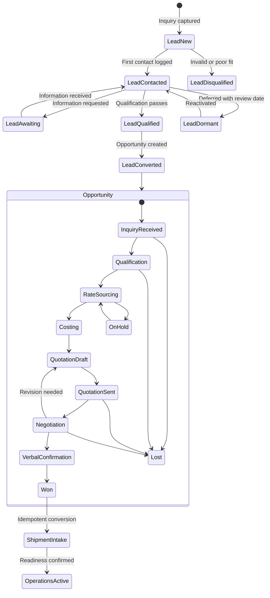
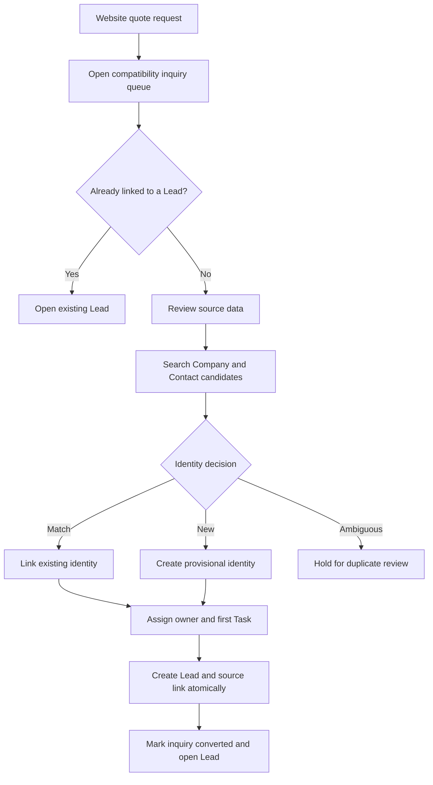
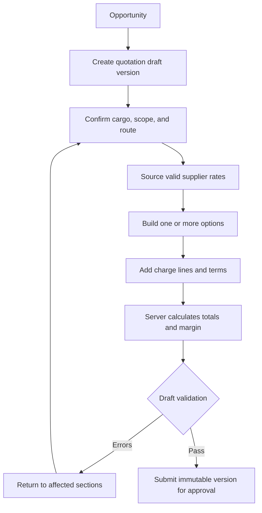
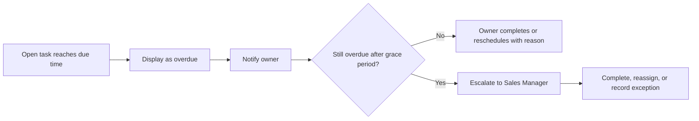
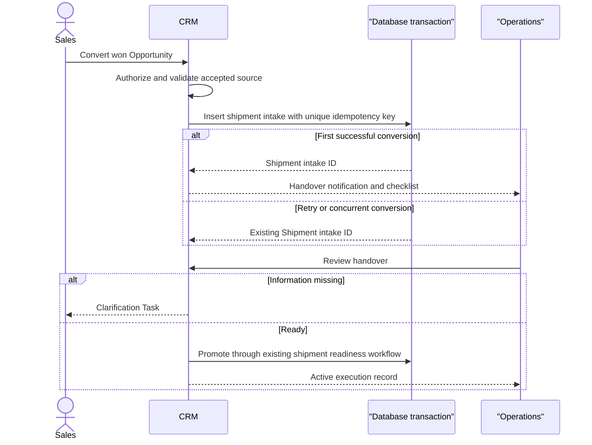
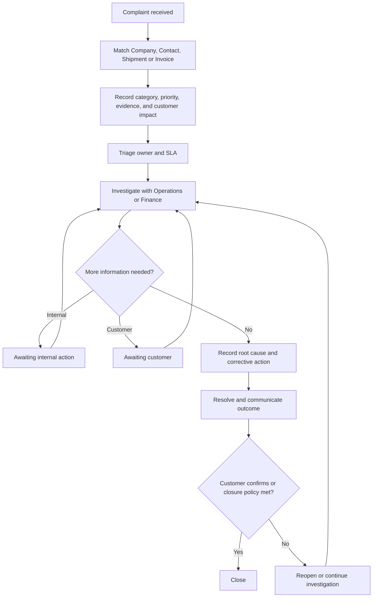

# Ambara Freight CRM — User Flows

**Document status:** Implementation baseline 
**Source-code baseline:** `origin/main` at `81ff43f421187eb76ef6c732ee141a7084a73dc3` 
**Canonical requirements:** [CRM-PRODUCT-REQUIREMENTS.md](./CRM-PRODUCT-REQUIREMENTS.md) 
**Authorization rules:** [CRM-PERMISSIONS-MATRIX.md](./CRM-PERMISSIONS-MATRIX.md) 
**Entity definitions:** [CRM-DATA-MODEL.md](./CRM-DATA-MODEL.md)

## 1. Purpose and conventions

This document defines the intended end-to-end behavior of Ambara’s commercial lifecycle. The first deployment implements only the core Company/Contact/Lead/Opportunity/Activity/Task/ownership/search/audit and quote-request bridge paths. Imports/exports, saved views, scheduled automation, native quotation, operational handover, Finance/retention, complaints, and provider integrations remain planned. The full flows are retained here as target behavior and must not be described as live before their own implementation and verification.

### 1.1 Actors

| Code | Actor | Typical responsibility |
|---|---|---|
| SA | Super Admin | Identity/configuration and controlled break-glass actions |
| D | Director | Company-wide oversight and policy approval |
| SM | Sales Manager | Team assignment, coaching, commercial approval |
| S | Sales | Lead, Opportunity, quotation, follow-up, negotiation |
| CS | Customer Service | Customer communication, Tasks, service issues |
| O | Operations | Won-deal readiness review and shipment execution |
| F | Finance | Invoice/payment/collections and approved commercial review |
| SYS | System | Validation, idempotency, reminders, audit, notifications |
| EXT | External party | Prospect, customer, overseas agent, vendor, or carrier |

### 1.2 Flow notation

- **Foundation** — implemented in Phases 1–2.
- **Phase 3** — native freight quotation.
- **Phase 4** — accepted quotation to shipment intake.
- **Phase 5** — Finance summaries, retention, and complaints.
- **Phase 6** — provider integrations and mature automation.
- “Archive” means reversible soft deletion. No flow below uses normal-UI hard deletion.
- Every mutation is authorized on the server; a hidden or disabled control is not a security boundary.
- All dates/times are stored as instants and presented in WIB by default.

### 1.3 Lifecycle state ownership

Lead statuses do not duplicate Opportunity or Quotation states. Existing `quote_requests.status` values remain a compatibility workflow for website inquiry intake until conversion is complete.

## 2. Cross-flow invariants

1. Every active Lead and Opportunity has an owner. Once contacted, each has one current next-action Task with a due date, or appears in a compliance exception queue.
2. A user can act only on records in their ownership/team/role scope. Reassignment does not grant historical access beyond the recipient’s new scope.
3. Company and Contact matching occurs before new identity records are committed. A provisional Lead may exist before identity is resolved, but qualification calls out that unresolved state.
4. Sales, Customer Service, Operations, and Viewer never receive supplier cost, gross profit, or margin fields. Only Super Admin, Director, Sales Manager, and Finance receive those fields.
5. Every Opportunity transition uses one server transition service and the same prerequisites. Any future drag/drop interaction must call that service; the initial pipeline uses explicit stage actions.
6. Sent, approved, accepted, rejected, expired, superseded, and withdrawn Quotation Versions are immutable.
7. Website inquiry conversion, import commit, quotation acceptance, and shipment conversion are idempotent.
8. Customer-facing content is built from an allowlisted selling-price DTO. Internal models are never serialized directly to public/customer channels.
9. Finance state is read from existing authoritative invoice/payment logic. CRM does not write a second balance or payment status.
10. Conflict responses preserve the user’s entered draft where safe and identify the fields changed by another user.

## 3. Flow 1 — Create a Lead

**Release:** Foundation 
**Primary actors:** S, SM, CS; SYS for website/import 
**Requirements:** CRM-FR-LEAD-001 through CRM-FR-LEAD-007, CRM-FR-COMPANY-005, CRM-FR-CONTACT-003

### Preconditions

- Actor is authenticated and has `crm:lead:create` in the target team/scope.
- Lead-source vocabulary and default assignment rule are configured.
- For a website source, an existing `quote_requests` row is present and has not already been converted.

### Manual capture: WhatsApp, email, referral, existing customer, partner, or outreach

1. User selects **New Lead** and chooses source.
2. The form asks first for identity: Company/trading name, Contact name, email, phone/WhatsApp, country, and source reference.
3. As the user types, the server returns authorized duplicate candidates based on normalized Company name, tax/NIB identifier where present, domain/email, phone, and Contact name within Company.
4. User selects an existing Company/Contact, creates provisional identity, or—only with the relevant permission—confirms an intentional new record after reviewing candidates.
5. User records requested service, origin, destination, commodity, cargo measures, Incoterm, target date, frequency/volume, customer target rate/currency, and notes. Unknown values remain explicitly “Not provided”; they are not treated as zero.
6. User assigns an owner or accepts the assignment rule. Lead starts as `new`.
7. User sets the first contact Task and due date. If policy allows saving without one, the Lead is immediately flagged in **Missing next action**.
8. SYS commits Company/Contact links or provisional fields, Lead, Task, source reference, and `lead.created` audit event in one transaction.
9. The owner receives an in-app assignment notification. Email escalation may be added by rule later.
10. The UI opens the Lead detail and shows missing qualification fields, due task, and activity timeline.

### Website inquiry conversion

1. User opens `/quotes/{id}` and selects **Convert to Lead**. A dedicated `/crm/inquiries/{id}` surface remains backlog.
2. SYS checks the unique source link. If already converted, it returns the existing Lead instead of creating another.
3. User reviews the original request; source values remain immutable on the inquiry while corrected/normalized values are stored on the Lead.
4. Duplicate candidates are resolved, owner and first Task are set, and missing fields are explicit.
5. SYS atomically creates the Lead/source link, records conversion audit metadata, and updates the compatibility workflow without deleting the original request.

### Failure and recovery

| Failure | Required behavior |
|---|---|
| Exact tax/NIB/email/phone collision | Block commit; show authorized candidate and action to open/review. |
| Fuzzy Company/name collision | Warn; require explicit selection or privileged “intentional duplicate” reason. |
| Owner became inactive | Reject assignment; preserve form values and request a new active owner. |
| Website conversion retried | Return existing Lead; do not duplicate activity, task, or notification. |
| Partial database failure | Roll back Lead, source link, Task, and audit together. |
| Attachment fails | Keep draft and identify failed file; do not create a silently incomplete committed Lead when attachment is mandatory. |
| User loses permission before save | Reject without revealing inaccessible record data; preserve only non-sensitive local draft where safe. |

### Audit events

`lead.created`, `lead.source_linked`, `lead.assigned`, `lead.duplicate_override`, `attachment.uploaded`.

## 4. Flow 2 — Qualify a Lead

**Release:** Foundation 
**Primary actors:** S; SM for overrides 
**Requirements:** CRM-FR-LEAD-003 through CRM-FR-LEAD-008, CRM-DEC-020

### Qualification inputs

- Confirmed Company/Contact or a documented provisional-identity reason.
- Requested service and trade direction.
- Origin and destination at the precision needed to source rates.
- Commodity and known regulated/special handling signals.
- Gross weight, dimensions/packages/CBM, or a recorded reason estimates are unavailable.
- Incoterm/service scope, target shipment/ready date, frequency/volume, target rate/currency where available.
- Consignee/importer/document readiness for DDP/DDU, undername, customs, controlled-goods, or similar services.
- Commercial fit, feasibility concerns, timing, decision process, and next action.

### Steps

1. Owner opens **Qualification** and reviews a checklist grouped by identity, routing, cargo, timing, regulatory/readiness, and commercial fit.
2. User contacts the Lead and logs the Activity outcome. `last_contacted_at` derives from the Activity, not manual free text.
3. Missing information produces an `awaiting_information` status and a due Task specifying what is needed and from whom.
4. When information arrives, user updates structured fields and logs the inbound Activity/attachment.
5. SYS computes the configured score and shows contributing factors. It never fabricates a score from missing values.
6. User chooses:
   - **Qualified:** minimum gates pass; move to `qualified` and offer **Create Opportunity**.
   - **Awaiting Information:** keep active with owner and next Task.
   - **Disqualified:** select structured reason, add notes, and close open Tasks.
   - **Dormant:** record why, reactivation/review date, and optional trigger.
7. An SM override may qualify despite a failed configurable gate only with reason; mandatory security/compliance gates cannot be bypassed by commercial override.
8. SYS writes the status/score history, closes or changes the current next-action Task, records audit, and notifies the owner/manager when appropriate.

### Failure and recovery

- A concurrent update returns a conflict summary; user reloads and reapplies rather than overwriting.
- Unsupported/regulated cargo is not automatically rejected unless approved rules say so; it is flagged for case-by-case review.
- DDP/DDU or undername eligibility is never inferred solely from Incoterm. Qualification records importer/consignee/document readiness and applicable review.
- Score calculation unavailable: show **Score unavailable**, retain manual workflow, and log technical failure; never default to zero or qualified.

## 5. Flow 3 — Create an Opportunity

**Release:** Foundation 
**Primary actors:** S, SM 
**Requirements:** CRM-FR-OPPORTUNITY-001 through CRM-FR-OPPORTUNITY-004

### Preconditions

- Lead is `qualified`, or SM records a justified direct-Opportunity exception for an existing customer/agent pursuit.
- Company, primary Contact, owner/team, service, and next action are resolved.

### Steps

1. User selects **Create Opportunity** from a qualified Lead.
2. SYS pre-fills Company, Contact, source, service, route, cargo, target date/rate, frequency, volume, owner/team, and attachments by reference.
3. User confirms whether this is a single pursuit or must split by service/route/timing. Splits create separately forecastable Opportunities and preserve one Lead source.
4. User enters opportunity name, estimated selling revenue, transaction currency, expected close, probability, priority, competitors/target-rate context, and next action.
5. For cost/margin fields, the server returns/edit rights only to SA/D/SM/F. Sales can enter requested selling/target information but never supplier cost.
6. Initial stage is `inquiry_received` or `qualification`; stage is never auto-skipped based solely on imported status text.
7. SYS creates Opportunity, source link, first Task, and stage history atomically, then marks Lead `converted` if no additional qualification work remains.
8. User lands on Opportunity **Overview** with missing-data and next-action indicators.

### Guardrails

- Reusing an idempotency token on form retry returns the created Opportunity.
- Duplicate open Opportunities for the same Company/service/route/target window generate a review warning.
- Estimated cost, gross profit, margin, and rate-source fields never appear in Sales request/response payloads.
- A converted Lead remains readable as source history; it is not deleted.

## 6. Flow 4 — Prepare a freight quotation

**Release:** Phase 3; Foundation supports only an external quotation reference 
**Primary actors:** S for customer/cargo/selling inputs; SM/D/F for confidential cost as permitted 
**Requirements:** CRM-FR-QUOTE-001 through CRM-FR-QUOTE-007, CRM-FR-QUOTE-011, CRM-FR-QUOTE-012

### Foundation fallback

Before Phase 3, the user records an external quotation number, customer amount/currency, sent date, validity, attachment or controlled link, and outcome under CRM-FR-OPPORTUNITY-009. The user must not paste supplier rate sheets or cost breakdowns into unrestricted notes/attachments.

### Native quotation steps

1. User selects **New Quotation** on an Opportunity in `rate_sourcing`, `costing`, or `quotation_draft`.
2. SYS copies current Company/Contact, service, route, cargo, Incoterm, target date, and terms into a new Quotation Version `v1` draft. It records source links; copied values are now draft snapshot fields.
3. User chooses service pattern: air, sea, domestic; airport/port/door scope; and applicable Incoterm/commercial label.
4. User completes cargo and readiness details: commodity, HS code if available, gross/chargeable weight, dimensions/packages/CBM, special handling, regulated flags, consignee/importer readiness, and documents.
5. Authorized cost users source supplier rates. Each rate shows supplier, route, service, validity, currency, unit, inclusions/exclusions, and evidence. An expired rate cannot be silently used.
6. User creates one or more customer Options. Each contains route, carrier, schedule estimate, transit estimate, scope, and charge lines.
7. Charge lines distinguish cost and selling amount, currency, unit/basis, quantity, minimum, tax treatment, conditional/confirmed state, customer visibility, and source rate.
8. SYS calculates totals, gross profit, and margin server-side using snapshotted FX and rounding policy. Unauthorized users receive only selling totals.
9. User adds validity, payment terms, exclusions, assumptions, conditional charges, and terms. DDP/DDU, undername, customs, duties/taxes, and regulated cargo use approved conditional wording.
10. User runs **Validate draft**. SYS checks required data, arithmetic, rate validity, negative/zero anomalies, customer-safe visibility, approval triggers, and attachment access.
11. User saves draft or submits it for approval. Submission freezes that Version and moves it to `pending_approval`.

### Failure and recovery

| Failure | Behavior |
|---|---|
| Supplier rate expires while drafting | Warn and block submission unless approved exception policy permits a reasoned override. |
| FX source unavailable | Preserve draft; do not guess. Authorized user may use a manual rate only if policy permits and source/reason are recorded. |
| Calculation mismatch | Server result is authoritative; block submission and surface affected lines. |
| Unsupported cargo/service | Route to case-by-case review; do not promise acceptance or customs outcome. |
| Another user edits draft | Optimistic conflict check; show version/field changes and allow deliberate reconciliation. |
| Customer-visible flag exposes internal charge | Customer-safe validation blocks approval/PDF/share. |

## 7. Flow 5 — Approve a quotation

**Release:** Phase 3 
**Primary actors:** SM, D, and other explicitly authorized approvers 
**Requirements:** CRM-FR-QUOTE-007 through CRM-FR-QUOTE-009, CRM-DEC-018

### Preconditions

- Version is immutable `pending_approval` and passes structural/calculation validation.
- Approval policy and required approver set are resolved from versioned rules.

### Steps

1. SYS evaluates triggers such as margin floor, discount, manual FX, expired/exception rate, conditional charge, payment/credit exception, or non-standard terms.
2. Required approver receives in-app notification and sees an approval queue ordered by due date/value/risk.
3. Approver opens a comparison view containing:
   - Customer-safe option and charge summary.
   - Confidential cost/margin details only if the approver’s role permits them.
   - Differences from the previous sent/approved Version.
   - Triggered rules, source-rate validity, terms, exclusions, and missing warnings.
4. Approver chooses:
   - **Approve:** optional comment; all required approvals completed moves Version to `approved`.
   - **Reject:** required reason; quotation owner creates a new revision.
   - **Request changes:** structured reasons/comments; current Version remains immutable and a new draft is created only when the owner accepts revision.
5. SYS records policy version, decision, actor, time, comment, and snapshot checksum. Owner is notified.
6. Approval does not send the quotation automatically unless a later explicit policy enables that behavior.

### Guardrails

- The quotation owner cannot self-approve when policy requires separation of duties.
- A permission change during an open approval invalidates the old decision session and rechecks authorization.
- Any pricing/term change after approval creates a new Version and invalidates the old Version as the current send candidate.
- Approval comments and cost data are never included in customer PDF/email/WhatsApp payloads.

## 8. Flow 6 — Send a quotation

**Release:** Phase 3 manual delivery; Phase 6 provider integration 
**Primary actors:** S, SM 
**Requirements:** CRM-FR-QUOTE-009, CRM-FR-QUOTE-010, CRM-FR-ACTIVITY-003

### Steps

1. User opens an `approved` Version and selects **Prepare to send**.
2. SYS regenerates/loads the customer-safe PDF from the exact approved Version and runs the confidentiality allowlist test.
3. User chooses authorized recipient Contacts and channel:
   - **Download/manual email or WhatsApp:** SYS records the file/version; user confirms actual delivery and logs channel/time.
   - **Integrated email/WhatsApp (Phase 6):** SYS sends through provider, stores provider message ID and delivery state.
4. User previews recipients, subject/message, validity deadline, options, attachments, and customer-visible terms.
5. User confirms. SYS rechecks approval/current-Version state and recipient access, then records `quotation.sent`.
6. Version becomes `sent`, Opportunity moves to `quotation_sent`, and a follow-up Task is created according to approved policy.
7. Repeated provider callback or user retry deduplicates on send idempotency key/provider message ID.

### Failure and recovery

- PDF generation failure leaves Version approved and unsent; retry is safe.
- Provider send failure records failed attempt but does not claim sent; manual fallback is offered.
- Wrong recipient discovered after send cannot erase history. User records incident, withdraws if appropriate, and creates a corrected Version/message.
- Validity already expired blocks send until a new Version is approved.

## 9. Flow 7 — Follow up

**Release:** Foundation for Tasks/external quotation; Phase 3 for native quotation 
**Primary actors:** S, CS, SM 
**Requirements:** CRM-FR-TASK-001 through CRM-FR-TASK-004, CRM-FR-AUTO-002 through CRM-FR-AUTO-004

### Steps

1. User opens **My Work** or a Lead/Opportunity/Quotation detail and sees due/overdue follow-ups.
2. User initiates or records call, WhatsApp, email, meeting, or note.
3. Activity form captures date/time, Contact, channel/type, outcome, summary, attachment, and next step.
4. User chooses an outcome:
   - Customer considering → create next Task.
   - More information needed → update structured missing information and Task.
   - Revision requested → start Flow 8.
   - Verbal confirmation → move Opportunity to `verbal_confirmation` but do not create a Shipment until accepted evidence/gate exists.
   - Rejected/no fit → start Flow 11.
   - No response → choose approved retry schedule; repeated attempts remain visible.
5. Completing the current Task and creating the next-action Task occur transactionally.
6. SYS updates `last_contacted_at` from the completed Activity, recalculates compliance, and clears/delays escalation as appropriate.

### Overdue behavior

Automation creates notifications/tasks only; it never fabricates a customer contact Activity.

## 10. Flow 8 — Revise a quotation

**Release:** Phase 3 
**Primary actors:** S, SM/D for reapproval 
**Requirements:** CRM-FR-QUOTE-006 through CRM-FR-QUOTE-010

### Preconditions

- Existing Version is identifiable and immutable.
- Revision reason is known: customer request, rate/FX change, route change, cargo change, validity extension, correction, or internal change.

### Steps

1. User selects **Create revision** from the relevant Version.
2. SYS clones its snapshot into `v{n+1}` draft and records `supersedes_version_id` plus required revision reason.
3. User changes only the required cargo, route, option, charge, validity, or term data.
4. SYS displays a structured diff for customer-visible and confidential fields, filtered by permission.
5. Draft follows validation and approval Flow 4–5. Prior Version stays unchanged and usable only according to its state.
6. Once the revised Version is sent, the previous sent Version becomes `superseded`; customer communication states which Version is current.
7. Existing acceptance links/tokens are version-bound. Superseded Version cannot be newly accepted unless a manager resolves a documented race according to policy.

### Race conditions

- **Customer accepts while revision is draft:** acceptance of still-current sent Version may proceed; owner is warned to reconcile draft.
- **Customer accepts after revised Version is sent:** superseded token returns a clear “new version available” response without exposing internal details.
- **Rates change after approval but before send:** if validity remains valid, policy controls whether send proceeds; otherwise new revision required.

## 11. Flow 9 — Mark an Opportunity won

**Release:** Foundation can record external accepted evidence; native flow in Phases 3–4 
**Primary actors:** S, SM 
**Requirements:** CRM-FR-OPPORTUNITY-004, CRM-FR-HANDOVER-001

### Preconditions

- One current accepted Quotation Version or approved external quotation reference exists.
- Company/customer relationship, primary Contact, service, route, cargo summary, target date, owner, and Operations handover requirements are sufficiently complete.
- Any required commercial approvals are complete.

### Steps

1. User selects **Mark won / Prepare handover**.
2. SYS validates accepted evidence, approval, current Version/reference, required Company/Contact links, and no existing won conversion.
3. User confirms customer purchase order/reference if applicable, accepted option, agreed scope, target shipment date, billing/contact details, and special/regulated-cargo flags.
4. User reviews a customer-safe commercial summary and Operations handover checklist. Confidential cost/margin remains role-filtered.
5. SYS moves Opportunity to `won`, records close date and selected commercial source, closes commercial follow-up Tasks, and creates a handover/readiness Task.
6. SYS notifies Operations and relevant Sales/Customer Service owners.
7. If Phase 4 is enabled, user continues to shipment conversion. Otherwise the won record remains queued for controlled handover.

### Guardrails

- `verbal_confirmation` alone is not equivalent to accepted evidence unless CRM-DEC-018 explicitly permits an override.
- Marking won does not issue an invoice, mark a payment, book a carrier, or make customs promises.
- Reopening a won Opportunity requires SM/D authority and reason; an already activated Shipment remains authoritative and is not silently deleted.

## 12. Flow 10 — Convert a won Opportunity into a Shipment

**Release:** Phase 4 
**Primary actors:** S/SM initiates; O reviews/activates; SYS enforces idempotency 
**Requirements:** CRM-FR-HANDOVER-001 through CRM-FR-HANDOVER-006

### Initiation

1. User selects **Create shipment intake** on a won Opportunity.
2. SYS rechecks record scope, accepted/current commercial source, Company/customer link, and whether a conversion already exists.
3. User reviews the proposed snapshot: customer, shipper/consignee Contacts, route, service, cargo/packages/weights, Incoterm, target date, documents, special handling, customs/readiness flags, selling scope, and internal handover notes.
4. User supplies only missing operational handover values. Changing accepted commercial terms routes back to a quotation revision/change process.
5. SYS computes a stable idempotency key from the accepted source and conversion purpose.
6. One database transaction:
   - Creates the existing shipment record in `operational_stage = intake` and appropriate non-active status.
   - Links Company/customer, Opportunity, and accepted commercial snapshot.
   - Copies operationally required snapshot fields and package rows.
   - Creates Operations readiness Task/checklist.
   - Records audit and outbox/notification event.
7. If the key already exists, SYS returns the existing intake and does not duplicate tasks or notifications.

### Operations review

1. O opens **Won handovers / Intake** queue.
2. O checks route, service, cargo, packages/weights, parties, documents, readiness, regulated/special handling flags, and accepted scope.
3. O chooses:
   - **Request clarification:** records structured missing items, sets due Task for Sales/CS, keeps intake gated.
   - **Confirm ready:** records reviewer/time and promotes the existing Shipment through its readiness workflow.
   - **Reject handover:** only for invalid/duplicate/non-executable intake, with reason and escalation; does not erase the won Opportunity.
4. Activation audit links the exact accepted commercial snapshot.

### Failure and recovery

| Failure | Required behavior |
|---|---|
| Browser refresh or network retry | Return existing Shipment intake by idempotency key. |
| Concurrent conversion | Unique constraint permits one; losing request reads and returns winner. |
| Required Contact/Company missing | Block conversion and link directly to missing-field correction. |
| Accepted quotation later disputed | Do not mutate shipment snapshot; create controlled commercial change/review. |
| Notification failure | Shipment transaction remains committed; notification retries from durable event state. |
| Operations activation fails | Intake remains visible and recoverable; do not create second Shipment. |
| Accidental duplicate from legacy/manual route | Detect linked commercial source; require privileged merge/void review rather than silent deletion. |

## 13. Flow 11 — Mark an Opportunity lost

**Release:** Foundation 
**Primary actors:** S, SM 
**Requirements:** CRM-FR-OPPORTUNITY-004, CRM-FR-OPPORTUNITY-008, CRM-FR-REPORT-002

### Steps

1. User selects **Mark lost** from any non-won Opportunity.
2. User chooses a structured reason, such as price, timing, no response, service unavailable, route unavailable, compliance/readiness, competitor, customer cancelled, duplicate, invalid inquiry, or other.
3. User records competitor/feedback and notes only when appropriate and permitted.
4. User chooses whether Company/Lead should remain active, become dormant with review date, or continue through another open Opportunity.
5. SYS validates that no accepted/current quotation or activated shipment conflicts with loss closure. Conflicts require manager review.
6. SYS sets stage `lost`, close date, reason, closes/cancels open Opportunity Tasks, and records audit.
7. A reactivation date may create a future Task without reopening the lost Opportunity.

### Reopen

- Authorized user chooses **Reopen** with reason and new expected close/next action.
- SYS creates a new stage-history event; it never erases the prior loss.
- If the commercial pursuit is materially different in service/route/timing, create a new Opportunity linked to the same Company instead of reopening.

## 14. Flow 12 — Reactivate a dormant Company or Lead

**Release:** Foundation for Lead; Phase 5 for derived inactivity 
**Primary actors:** S, SM, CS 
**Requirements:** CRM-FR-LEAD-008, CRM-FR-RETENTION-001 through CRM-FR-RETENTION-003

### Steps

1. User opens a dormant Lead or inactive-account queue generated from the approved policy.
2. UI shows why it is dormant/inactive, last qualifying Activity/Shipment, prior service/route, open Opportunities/Complaints, outstanding invoice indicator, and data freshness within the caller’s permission.
3. User verifies Company/Contact details and current ownership. Duplicate candidates are resolved before creating new identity.
4. User logs outreach and outcome.
5. If interest returns:
   - Reactivate Lead to `contacted` and create next Task; or
   - Create a new Lead/Opportunity for a materially new service/route/timing, linked to prior history.
6. If no interest/no response, user records outcome and next review date according to policy.
7. SYS updates dormancy/health signals, records audit, and avoids double-counting reactivation as a new acquisition unless metric definition says so.

### Guardrails

- Outstanding invoice visibility/action remains Finance-scoped; Sales/CS receives only the approved indicator and escalation path.
- Lack of synchronized shipment data produces **Data stale/unavailable**, not a churn label.
- Complaint/open-case context must be visible before outreach where role permits.

## 15. Flow 13 — Handle a Complaint

**Release:** Phase 5 
**Primary actors:** CS; O/F according to issue; SM/D for escalation 
**Requirements:** CRM-FR-COMPLAINT-001 through CRM-FR-COMPLAINT-003, CRM-DEC-027

### Steps

1. CS selects **New Complaint** from Company, Contact, Shipment, Invoice, or global action.
2. User matches Company/Contact and, where applicable, Shipment/Invoice. The system never exposes inaccessible records during lookup.
3. User records received channel/time, category, description, customer impact, priority, requested resolution, and supporting documents.
4. SYS assigns Complaint ID, `new` status, owner/queue, due/SLA values from approved policy, and acknowledges receipt through the selected manual/integrated channel.
5. Triage verifies category/priority and moves to `triaged` or `investigating`. Delay/damage/missing cargo/document/customs/delivery issues may assign Operations Tasks; billing/rate discrepancy may assign Finance/commercial Tasks.
6. Investigation logs Activities, evidence, internal findings, customer updates, and waiting state. Internal notes and customer-visible communication remain separate.
7. Owner records root cause, corrective action, resolution, resolution date, and customer response; status becomes `resolved`.
8. Closure requires customer confirmation or the approved closure rule; status becomes `closed` with audit.
9. New evidence can `reopen` the Complaint, preserving prior resolution/closure history and recalculating SLA according to policy.

### Failure and recovery

- Missing Shipment/Invoice does not block initial complaint capture; it creates a linkage Task.
- Sensitive operational or Finance notes are never sent to the customer timeline.
- Attachment validation failure is explicit; user can retry without duplicate Complaint.
- SLA job failure surfaces technical health and recomputes safely; it does not hide overdue cases.
- Complaint deletion is archive-only and restricted; linked shipment/financial evidence is not deleted.

## 16. Supporting flows

### 16.1 Reassign a record

1. Authorized user selects new active owner/team and required reason.
2. SYS validates source and destination scope, open Tasks, and any team boundary.
3. User chooses whether open Tasks follow the record or remain with collaborators; prohibited combinations are blocked.
4. SYS updates ownership atomically, records prior/new owner, and notifies both owners plus manager as configured.
5. Saved views, counts, and search visibility change immediately; notifications do not expose fields beyond recipient permission.

### 16.2 Archive and restore

1. User chooses **Archive**, reviews dependencies, enters reason, and confirms exact record identity for high-impact records.
2. SYS blocks archive when an active won handover, open financial dependency, or policy-protected state requires another flow.
3. Record leaves default active views but remains linked and auditable.
4. Privileged **Restore** checks duplicate/conflict state, requires reason, and returns it to a safe non-active status if prior active state is no longer valid.

### 16.3 Merge duplicate Company/Contact

1. Privileged user opens duplicate-review pair/group.
2. SYS previews identity fields, links, conflicts, portal/customer compatibility, active Opportunities, Shipments, Invoices, Contacts, and audit.
3. User selects surviving record and field winners. Exact identifiers cannot be assigned to two survivors.
4. Transaction reassigns links, stores aliases/redirects, archives duplicates, and records a detailed merge audit.
5. Portal authentication/customer compatibility is handled by a dedicated merge rule; password/session state is never copied casually.

### 16.4 Import and bulk update

1. User uploads CSV/XLSX into a staged Import Job.
2. SYS validates file, headers, types, mappings, normalized values, permission, duplicates, and references without mutating business records.
3. User reviews row-level errors/warnings, corrects file or mapping, and reruns dry-run.
4. Authorized user confirms exact counts/entity/target team and commits.
5. SYS commits valid policy-approved scope transactionally or in explicit audited batches; row results and error report are preserved.
6. Repeating the same committed import fingerprint returns prior result unless user creates an explicitly new job.

## 17. Cross-cutting exception and recovery matrix

| Scenario | User experience | System behavior | Audit/alert |
|---|---|---|---|
| Duplicate Company/Contact | Candidate drawer with matched signals; strong collision blocks | Normalize and compare server-side; no hidden override | `duplicate.reviewed` or `duplicate.override` |
| Missing qualification information | Checklist links to exact fields and next Task | Block configured transition, not draft save | `transition.blocked` telemetry; no false status audit |
| Unauthorized action | Neutral forbidden message and safe return path | Recheck record + field + action scope | Security event without private field values |
| Concurrent edit | Conflict banner and structured diff | No last-write-wins for protected transitions | `write.conflict` telemetry |
| Inactive owner | Assignment selector refresh | Reject commit; preserve draft | Admin health only if systemic |
| Approval rejected | Immutable rejected decision and revision action | Never reopen/edit submitted Version | `quotation.approval_rejected` |
| Quotation expired | Clear expired status and **Create revision** | Version remains immutable; acceptance blocked | Expiry event idempotent |
| Conversion retried | Open existing Shipment intake | Unique idempotency key returns existing row | One conversion audit/event only |
| Notification/email failure | In-app state remains; retry indicator if relevant | Business transaction not rolled back after durable event | Delivery failure alert |
| Import partial failure | Exact committed/failed count and downloadable report | Policy-defined transactional batch; no silent skips | Job + row outcomes |
| Data source stale | “Data last refreshed…” warning | Do not derive new business status from stale data | Freshness health alert |
| Attachment unavailable | File-specific error and owner recovery | Preserve metadata/state; do not return raw storage URL | Download/access failure telemetry |
| Public/customer data leak test fails | Block PDF/API/send | Fail closed before serialization/delivery | Critical security alert |

## 18. Flow-level acceptance scenarios

The following scenarios must be automated where practical and completed as role-based staging smoke tests:

1. Convert one website inquiry twice; both requests return the same Lead and only one assignment notification exists.
2. Attempt Lead creation with exact email/phone and fuzzy Company matches; exact blocks, fuzzy requires review, override is privileged/audited.
3. Qualify without required routing/cargo context; transition blocks while draft and missing-information Task remain usable.
4. Create Opportunity from qualified Lead and confirm source history, owner, current Task, stage history, and permission-filtered values.
5. Sales requests Opportunity/search/report/export and cannot find or infer another salesperson’s records or any cost/margin field.
6. Move a card on Kanban and stage from detail; both enforce identical prerequisites and conflict behavior.
7. Record an external quotation in Foundation Release, follow it up, and close won/lost without presenting it as a native immutable Version.
8. Prepare two quotation Options with mixed currencies; verify server totals, FX snapshot, minimum charges, conditional lines, and permission-safe DTOs.
9. Reject approval, create revision, approve/send it, and prove the rejected/previous versions cannot change.
10. Generate/download/send a customer quotation and inspect PDF, email payload, logs, and public DTO for absence of cost/margin/internal data.
11. Attempt acceptance of a superseded/expired Version and receive a safe recovery path to the current Version.
12. Convert accepted quotation concurrently; exactly one existing Shipment intake is created and Operations receives one checklist.
13. Return intake for clarification, resolve it, then activate through the existing shipment workflow without changing accepted commercial history.
14. Lose/reopen an Opportunity and verify both close histories remain in reports.
15. Reactivate a dormant Company with stale shipment data; UI warns of staleness and does not assert churn as fact.
16. Create, investigate, resolve, close, and reopen a Complaint with Operations/Finance subtasks and customer/internal note separation.
17. Execute core Lead update, Activity log, Task creation/completion, customer lookup, quotation status review, and approval at 360 px.
18. Simulate notification/provider failure; primary transaction remains correct, failure is visible, and retry does not duplicate customer communication.
